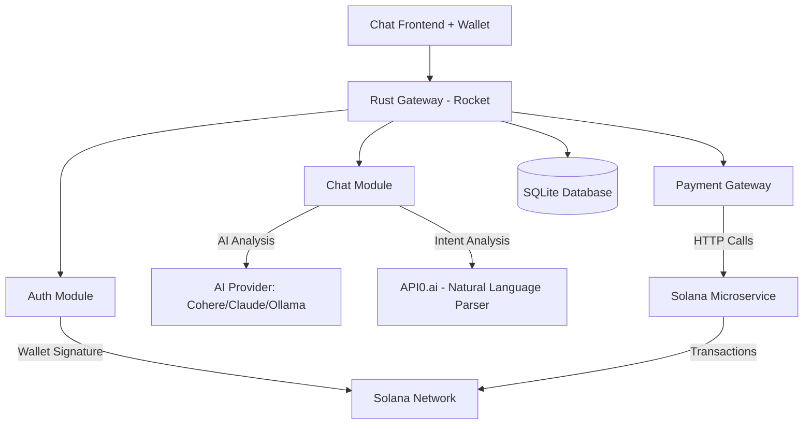
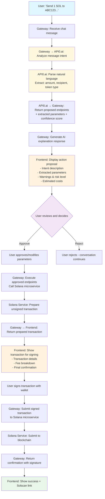
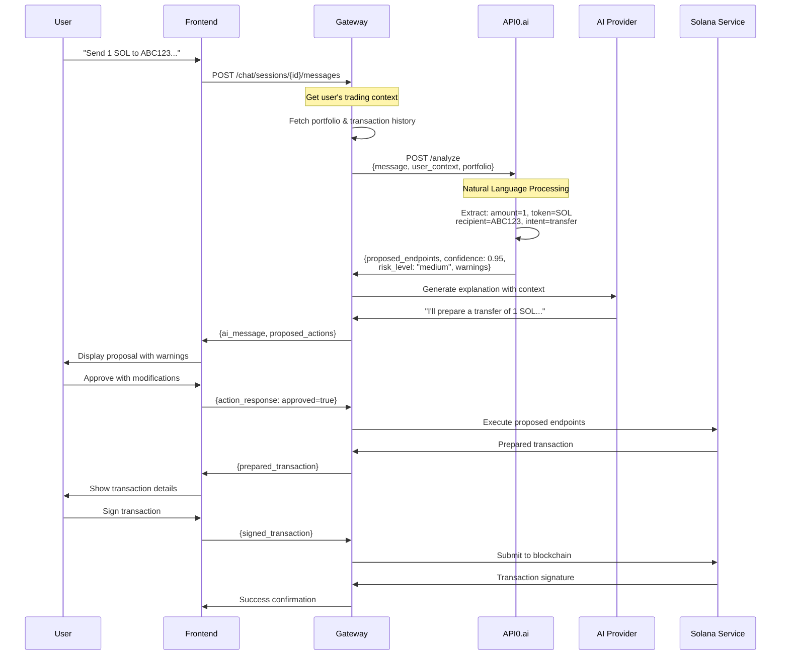

# Solana Gateway

A chat-first Rust gateway for Solana trading with AI-powered transaction validation and API0.ai intent recognition.

## Architecture



## Core Philosophy: Chat-First with Mandatory User Validation

This gateway implements a **chat-first architecture** where all blockchain operations flow through conversational AI with API0.ai-powered intent recognition and mandatory user validation for safety.

### Complete Transaction Flow with API0.ai Integration



### API0.ai Integration Flow



## Features

- **AI-Powered Intent Recognition**: API0.ai analyzes natural language and extracts transaction parameters
- **Mandatory User Validation**: Users must explicitly approve all blockchain operations with full transparency
- **Chat-Only Interface**: All operations happen through conversational AI - no complex transaction UIs
- **Risk Assessment**: Each action includes risk levels, cost estimates, and clear warnings
- **Trading Context Awareness**: AI has access to user's portfolio and transaction history for personalized advice
- **Multi-Provider AI Support**: Cohere, Claude, or Ollama for natural language responses
- **Wallet-First Authentication**: Solana wallet signature-based auth with JWT
- **Configuration-Driven**: All parameters in YAML files

## Quick Start

```bash
# Clone and setup
git clone <repo>
cd solana-gateway

# Configure
cp config.yaml.example config.yaml
# Edit config.yaml with your AI provider settings

# Run database migrations and start
cargo run
```

## API Endpoints

### Authentication
- `POST /api/v1/auth/challenge/{wallet_address}` - Get challenge message
- `POST /api/v1/auth/verify` - Verify signature and get JWT  
- `POST /api/v1/auth/refresh` - Refresh JWT token

### Chat (JWT Required) - Primary Interface
- `POST /api/v1/chat/sessions` - Create chat session
- `GET /api/v1/chat/sessions` - List user sessions
- `POST /api/v1/chat/sessions/{id}/messages` - Send message (handles API0.ai analysis, actions & transactions)
- `GET /api/v1/chat/sessions/{id}/messages` - Get session messages
- `DELETE /api/v1/chat/sessions/{id}` - Delete session

### Supporting Endpoints (JWT Required)
- `POST /api/v1/transactions/wallet/tokens` - Get portfolio for AI context
- `POST /api/v1/transactions/price` - Get token prices for AI analysis
- `GET /api/v1/chat/health` - Check AI service health

## API0.ai Natural Language Processing

### Message Analysis
API0.ai processes user messages to extract actionable blockchain intents:

**Input to API0.ai:**
```json
{
  "message": "Send 1 SOL to ABC123...",
  "user_context": {
    "wallet_address": "user_wallet_here",
    "portfolio": {
      "total_value_usd": 1250.45,
      "tokens": [...],
      "recent_transactions": [...]
    }
  }
}
```

**Output from API0.ai:**
```json
{
  "intent_detected": true,
  "intent_type": "transfer",
  "confidence_score": 0.95,
  "extracted_parameters": {
    "amount": 1.0,
    "token": "SOL",
    "recipient": "ABC123...",
    "sender": "user_wallet_here"
  },
  "proposed_endpoints": [
    {
      "endpoint": "/api/v1/transaction/prepare",
      "method": "POST",
      "description": "Prepare SOL transfer transaction",
      "params": {
        "payer_pubkey": "user_wallet_here",
        "to_address": "ABC123...",
        "amount": 1.0
      },
      "risk_level": "medium"
    }
  ],
  "estimated_cost": 0.000005,
  "warnings": [
    "This will transfer real SOL from your wallet",
    "Transaction is irreversible once confirmed"
  ]
}
```

### Supported Intent Types
- **transfer**: Send SOL or SPL tokens to another wallet
- **swap**: Exchange tokens via Jupiter protocol
- **balance**: Check wallet balances and token holdings
- **history**: View transaction history and activity
- **price**: Get current token prices and market data
- **portfolio**: Analyze holdings and performance

### Natural Language Examples

```
"Send 0.5 SOL to my friend's wallet DEF456..."
→ Extracts: amount=0.5, token=SOL, recipient=DEF456...

"Swap 100 USDC for SOL"
→ Extracts: from_token=USDC, to_token=SOL, amount=100

"How much is my portfolio worth?"
→ Intent: portfolio_analysis, no parameters needed

"Check if my transfer to ABC123 went through"
→ Intent: transaction_status, recipient=ABC123
```

## Message Flow Types

### Regular Chat
```json
// Request
{
  "content": "What's the current market trend for SOL?"
}

// Response
{
  "user_message": {...},
  "ai_message": {
    "content": "Based on your portfolio data, SOL is showing..."
  },
  "proposed_actions": null,
  "prepared_transaction": null
}
```

### Action Proposal (via API0.ai)
```json
// User: "Send 1 SOL to ABC123..."

// Response
{
  "user_message": {...},
  "ai_message": {
    "content": "I understand you want to: Transfer SOL to another wallet\n\nProposed actions:\n• POST: Prepare SOL transfer transaction\n\n⚠️ Warnings:\n• This will transfer real SOL from your wallet\n\n💰 Estimated cost: 0.000005 SOL\n\nConfidence: 95%\n\nDo you want me to proceed with these actions?"
  },
  "proposed_actions": {
    "action_id": "uuid-here",
    "intent_description": "Transfer SOL to another wallet",
    "confidence_score": 0.95,
    "endpoints_to_call": [
      {
        "endpoint": "/api/v1/transaction/prepare",
        "method": "POST",
        "description": "Prepare SOL transfer transaction",
        "params": {
          "payer_pubkey": "user_wallet",
          "to_address": "ABC123...",
          "amount": 1.0
        },
        "risk_level": "medium"
      }
    ],
    "estimated_cost": 0.000005,
    "warnings": ["This will transfer real SOL from your wallet"]
  },
  "prepared_transaction": null
}
```

### Action Approval
```json
// Request
{
  "content": "User approved actions",
  "action_response": {
    "action_id": "uuid-here",
    "approved": true,
    "modified_params": {
      "amount": 0.5  // User can modify parameters
    }
  }
}

// Response
{
  "user_message": {...},
  "ai_message": {
    "content": "Transaction prepared. Please review and sign."
  },
  "proposed_actions": null,
  "prepared_transaction": {
    "transaction_id": "tx-uuid",
    "transaction_type": "transfer",
    "unsigned_transaction": "base64...",
    "from_address": "user_wallet",
    "to_address": "ABC123...",
    "amount": 0.5,
    "token": "SOL",
    "fee_estimate": 0.000005
  }
}
```

### Transaction Signing
```json
// Request
{
  "content": "Transaction signed",
  "signed_transaction": "base64_signed_transaction_here",
  "transaction_id": "tx-uuid"
}

// Response
{
  "user_message": {...},
  "ai_message": {
    "content": "Transaction submitted successfully! Signature: ABC123... You can track it on Solana Explorer."
  },
  "proposed_actions": null,
  "prepared_transaction": null
}
```

## Safety & Security Features

### Mandatory User Validation
- **No Direct Execution**: API0.ai analysis never directly triggers blockchain operations
- **Explicit Approval**: Users must approve each proposed action before execution
- **Risk Assessment**: All actions include risk levels (none/low/medium/high)
- **Cost Transparency**: Estimated fees shown upfront
- **Parameter Modification**: Users can adjust amounts, addresses before approval
- **Clear Warnings**: Explicit warnings for irreversible operations

### Trading Context Integration
- **Portfolio Awareness**: AI has access to user's current token holdings and USD values
- **Transaction History**: AI considers recent trading patterns for better advice
- **Market Data**: Real-time token prices inform AI recommendations
- **Personalized Advice**: Responses based on actual user data, not generic information

## Configuration

Key parameters in `config.yaml`:

```yaml
auth:
  jwt_expires_hours: 24
  challenge_expires_minutes: 5

chat:
  ai_provider: "cohere"  # or "claude", "ollama"
  api_providers:
    cohere:
      model: "command-r7b-12-2024"  # Updated from deprecated command-r-plus
      api_key: "${COHERE_API_KEY}"
      base_url: "https://api.cohere.ai"
      endpoint: "/v1/chat"
      response_path: "text"

payment:
  solana_service_url: "http://localhost:8000" # Solana microservice
  premium_price_sol: 0.1
  timeout_seconds: 30
```

## API0.ai Integration (Placeholder)

The system includes placeholders for API0.ai integration:

```rust
// In production, this will call API0.ai
async fn get_proposed_actions_from_api0(
    user_message: &str,
    user_wallet: &str,
    trading_context: &serde_json::Value,
) -> AppResult<Option<ProposedActions>> {
    // TODO: Replace with actual API0.ai call
    // 
    // let api0_request = Api0Request {
    //     message: user_message.to_string(),
    //     user_context: trading_context
    // };
    // 
    // let response = self.client
    //     .post("https://api0.ai/analyze")
    //     .json(&api0_request)
    //     .send()
    //     .await?;
}
```

## Frontend Integration

```javascript
// Send regular message
const response = await fetch('/api/v1/chat/sessions/123/messages', {
  method: 'POST',
  headers: {
    'Content-Type': 'application/json',
    'Authorization': `Bearer ${jwt}`
  },
  body: JSON.stringify({
    content: "Should I buy more SOL?"
  })
});

// Handle action approval
const approvalResponse = await fetch('/api/v1/chat/sessions/123/messages', {
  method: 'POST',
  headers: {
    'Content-Type': 'application/json',
    'Authorization': `Bearer ${jwt}`
  },
  body: JSON.stringify({
    content: "User approved actions",
    action_response: {
      action_id: "uuid-from-proposal",
      approved: true,
      modified_params: {
        amount: 0.5  // User adjusted amount
      }
    }
  })
});

// Submit signed transaction
const signingResponse = await fetch('/api/v1/chat/sessions/123/messages', {
  method: 'POST',
  headers: {
    'Content-Type': 'application/json',
    'Authorization': `Bearer ${jwt}`
  },
  body: JSON.stringify({
    content: "Transaction signed",
    signed_transaction: signedTxBase64,
    transaction_id: "tx-uuid-from-preparation"
  })
});
```

## Microservice Architecture

The gateway orchestrates multiple services:

**Gateway Responsibilities:**
- JWT authentication and user management
- Chat session management
- AI provider integration (Cohere/Claude/Ollama)
- API0.ai intent analysis coordination
- Transaction state management and user approval flow
- Error handling and rate limiting

**Solana Service Responsibilities:**
- Blockchain transaction preparation and submission
- Wallet balance and token data retrieval
- Fee estimation and network interaction
- Solana-specific error handling

**Frontend Responsibilities:**
- Chat interface and message display
- Action proposal validation UI
- Transaction signing with wallet
- Portfolio display for user context

## Solana Microservice API (Required)

```
# Health check
GET /api/v1/health
→ {"success": true, "data": "OK", "error": null}

# Prepare SOL transfer
POST /api/v1/transaction/prepare
{
  "payer_pubkey": "wallet_address",
  "to_address": "recipient_address", 
  "amount": 0.1
}

# Prepare token swap
POST /api/v1/swap/prepare
{
  "payer_pubkey": "wallet_address",
  "from_token": "SOL",
  "to_token": "USDC",
  "amount": 0.1
}

# Submit signed transaction
POST /api/v1/transaction/submit
{
  "signed_transaction": "base64_encoded_signed_tx"
}

# Check balance
POST /api/v1/balance
{
  "pubkey": "wallet_address"
}

# Get transaction history
POST /api/v1/transactions/history
{
  "wallet_address": "wallet_address",
  "limit": 50,
  "offset": 0
}

# Get wallet tokens
POST /api/v1/wallet/tokens
{
  "wallet_address": "wallet_address"
}

# Get token prices
POST /api/v1/price
{
  "tokens": ["SOL", "USDC", "RAY"]
}
```

## Production Notes

- **Error Handling**: No unwraps, comprehensive error types
- **Logging**: Structured tracing throughout
- **Database**: SQLite with migration system
- **Testing**: `cargo test`
- Update JWT secret in production
- Configure proper Solana RPC endpoints
- Set up AI provider integration
- Consider database migrations for scaling
