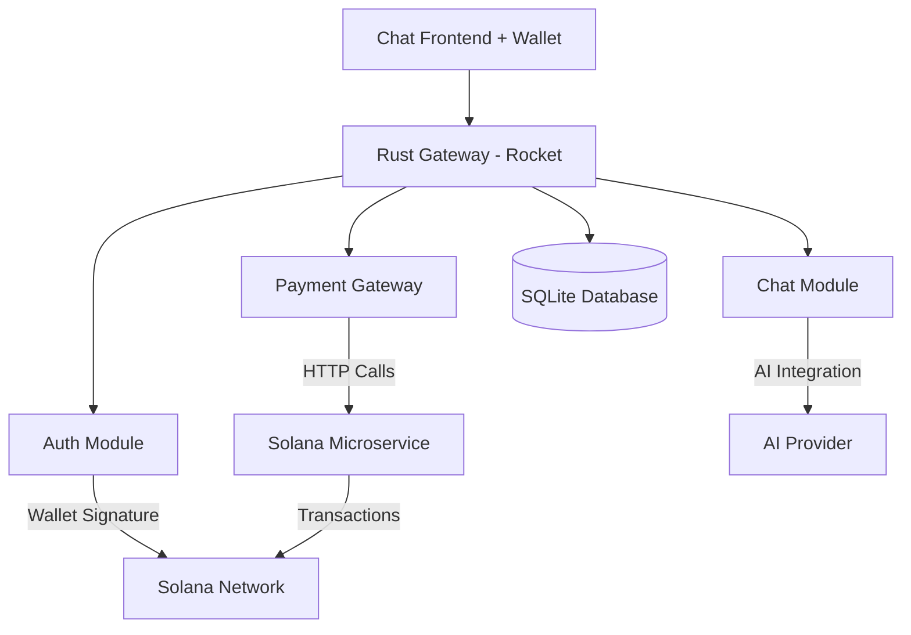

# Solana Gateway

A wallet-first Rust gateway for Solana services with chat and payment capabilities.

## Architecture



## Features

- **Wallet-First Authentication**: Solana wallet signature-based auth with JWT
- **Chat System**: CRUD operations with Ollama AI integration
- **Payment Gateway**: Orchestrates Solana transactions through dedicated microservice
- **Modular Design**: Clean separation with potential microservice extraction
- **Configuration-Driven**: All parameters in YAML

## Quick Start

```bash
# Clone and setup
git clone <repo>
cd solana-gateway

# Install Ollama (if not already installed)
curl -fsSL https://ollama.ai/install.sh | sh

# Pull a model (choose one)
ollama pull llama3.1        # Recommended: Latest Llama
ollama pull llama2          # Alternative: Llama 2
ollama pull codellama       # For code-related queries
ollama pull mistral         # Faster, smaller model

# Configure
cp config.yaml.example config.yaml
# Edit config.yaml with your settings and chosen model

# Run database migrations and start
cargo run
```

## API Endpoints

### Authentication
- `POST /api/v1/auth/challenge/{wallet_address}` - Get challenge message
- `POST /api/v1/auth/verify` - Verify signature and get JWT
- `POST /api/v1/auth/refresh` - Refresh JWT token

### Chat (JWT Required)
- `POST /api/v1/chat/sessions` - Create chat session
- `GET /api/v1/chat/sessions` - List user sessions
- `POST /api/v1/chat/sessions/{id}/messages` - Send message (gets Ollama response)
- `GET /api/v1/chat/sessions/{id}/messages` - Get session messages
- `GET /api/v1/chat/health` - Check Ollama service health
- `GET /api/v1/chat/models` - List available Ollama models

### Transactions (JWT Required)
- `POST /api/v1/transactions/create` - Create transaction via Solana service
- `POST /api/v1/transactions/confirm` - Confirm signed transaction via Solana service
- `GET /api/v1/transactions/history` - Get transaction history
- `GET /api/v1/transactions/balance/{wallet_address}` - Check wallet balance
- `GET /api/v1/transactions/health` - Check Solana service health

## Configuration

Key parameters in `config.yaml`:

```yaml
auth:
  jwt_expires_hours: 24
  challenge_expires_minutes: 5

chat:
  ai_provider: "ollama"
  ollama_url: "http://localhost:11434"
  ollama_model: "llama3.1"
  ollama_timeout_seconds: 30

payment:
  solana_service_url: "http://localhost:8001" # Solana microservice
  premium_price_sol: 0.1
  timeout_seconds: 30
```

## Frontend Integration

```javascript
// Wallet connection flow
const connectWallet = async () => {
  const { publicKey } = await phantom.connect();
  const challenge = await api.getChallenge(publicKey);
  const signature = await phantom.signMessage(challenge);
  const { jwt } = await api.verifySignature(publicKey, signature, challenge);
  setAuth(jwt);
};

// Payment flow
const handlePremiumUpgrade = async () => {
  const { transaction } = await api.createTransaction('premium_upgrade');
  const signed = await phantom.signTransaction(transaction);
  await api.confirmTransaction(signed);
};
```

## Microservice Architecture

The gateway acts as a **transaction orchestrator**, delegating Solana operations to specialized services:

**Solana Microservice API (Required):**
```
# Health check
GET /api/v1/health
→ {"success": true, "data": "OK", "error": null}

# Prepare SOL transfer
POST /api/v1/transaction/prepare
{
  "payer_pubkey": "wallet_address",
  "to_address": "recipient_address", 
  "amount": 0.1
}

# Prepare token swap
POST /api/v1/swap/prepare
{
  "payer_pubkey": "wallet_address",
  "from_token": "SOL",
  "to_token": "USDC",
  "amount": 0.1
}

# Submit signed transaction
POST /api/v1/transaction/submit
{
  "signed_transaction": "base64_encoded_signed_tx"
}

# Check balance
POST /api/v1/balance
{
  "pubkey": "wallet_address"
}
```

**Gateway Responsibilities:**
- Transaction state management (pending/confirmed/failed)
- Business logic (premium upgrades, user state changes)
- Error handling and retry logic
- Transaction history and audit trail

**Solana Service Responsibilities:**
- Solana network interaction
- Transaction creation and submission
- Fee estimation and optimization
- Network-specific error handling

- **Error Handling**: No unwraps, comprehensive error types
- **Logging**: Structured tracing throughout
- **Database**: SQLite with migration system
- **Testing**: `cargo test`

## Production Notes

- Update JWT secret in production
- Configure proper Solana RPC endpoints
- Set up AI provider integration
- Consider database migrations for scaling
