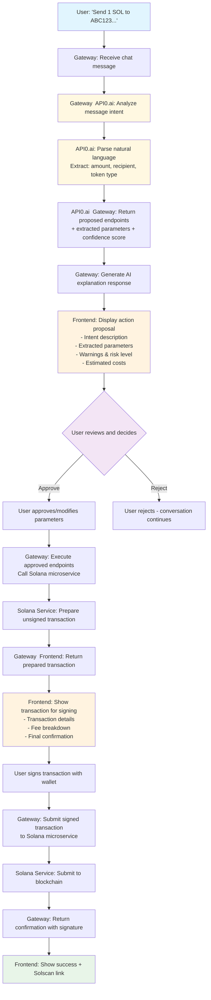

This file is a merged representation of a subset of the codebase, containing files not matching ignore patterns, combined into a single document by Repomix.

# File Summary

## Purpose
This file contains a packed representation of the entire repository's contents.
It is designed to be easily consumable by AI systems for analysis, code review,
or other automated processes.

## File Format
The content is organized as follows:
1. This summary section
2. Repository information
3. Directory structure
4. Repository files (if enabled)
5. Multiple file entries, each consisting of:
  a. A header with the file path (## File: path/to/file)
  b. The full contents of the file in a code block

## Usage Guidelines
- This file should be treated as read-only. Any changes should be made to the
  original repository files, not this packed version.
- When processing this file, use the file path to distinguish
  between different files in the repository.
- Be aware that this file may contain sensitive information. Handle it with
  the same level of security as you would the original repository.

## Notes
- Some files may have been excluded based on .gitignore rules and Repomix's configuration
- Binary files are not included in this packed representation. Please refer to the Repository Structure section for a complete list of file paths, including binary files
- Files matching these patterns are excluded: content
- Files matching patterns in .gitignore are excluded
- Files matching default ignore patterns are excluded
- Files are sorted by Git change count (files with more changes are at the bottom)

# Directory Structure
```
.cargo/
  config.toml
src/
  api/
    mod.rs
    wallet.rs
  auth/
    guards.rs
    handlers.rs
    mod.rs
    service.rs
  chat/
    handlers.rs
    mod.rs
    service.rs
  payment/
    handlers.rs
    mod.rs
    service.rs
  solana/
    mod.rs
    solana_service.rs
  config.rs
  db.rs
  error.rs
  lib.rs
  main.rs
  types.rs
.gitignore
Cargo.toml
config.yaml
config.yaml.example
README.md
solana-micro-service-api_spec.md
```

# Files

## File: .cargo/config.toml
````toml
[build]
target-dir = "target"
````

## File: src/api/mod.rs
````rust
pub mod wallet;
````

## File: src/api/wallet.rs
````rust
use rocket::{State, get, post, serde::json::Json};
use crate::{
    auth::User,
    solana::solana_service::SolanaService,
    config::AppConfig,
    error::AppResult,
    types::{WalletBalanceResponse, WalletTokensResponse, WalletHistoryRequest, TransactionHistoryResponse},
};

#[get("/balance")]
pub async fn get_balance(
    user: User,
    config: &State<AppConfig>,
) -> AppResult<Json<WalletBalanceResponse>> {
    let solana_service = SolanaService::new(config);
    let balance = solana_service.get_balance(&user.wallet_address).await?;
    
    Ok(Json(WalletBalanceResponse {
        wallet_address: user.wallet_address.clone(),
        balance: balance.balance,
        token: balance.token,
    }))
}

#[get("/tokens")]
pub async fn get_tokens(
    user: User,
    config: &State<AppConfig>,
) -> AppResult<Json<WalletTokensResponse>> {
    let solana_service = SolanaService::new(config);
    let tokens = solana_service.get_wallet_tokens(&user.wallet_address).await?;
    Ok(Json(tokens))
}

#[post("/history", data = "<request>")]
pub async fn get_history(
    request: Json<WalletHistoryRequest>,
    _user: User,
    config: &State<AppConfig>,
) -> AppResult<Json<TransactionHistoryResponse>> {
    let solana_service = SolanaService::new(config);
    let history = solana_service
        .get_transaction_history(&request.wallet_address, request.limit, request.offset)
        .await?;
    Ok(Json(history))
}

#[get("/health")]
pub async fn health_check(config: &State<AppConfig>) -> AppResult<Json<serde_json::Value>> {
    let solana_service = SolanaService::new(config);
    let healthy = solana_service.health_check().await.unwrap_or(false);
    
    Ok(Json(serde_json::json!({
        "solana_service": {
            "url": config.payment.solana_service_url,
            "healthy": healthy
        }
    })))
}
````

## File: src/auth/guards.rs
````rust
use rocket::{
    Request, State,
    http::Status,
    request::{FromRequest, Outcome},
};
use sqlx::SqlitePool;
use uuid::Uuid;

use crate::{
    auth::service::AuthService, config::AppConfig, error::AppError, types::User as UserType,
};

// Request guard for JWT authentication
pub struct User(pub UserType);

impl std::ops::Deref for User {
    type Target = UserType;

    fn deref(&self) -> &Self::Target {
        &self.0
    }
}

#[rocket::async_trait]
impl<'r> FromRequest<'r> for User {
    type Error = AppError;

    async fn from_request(req: &'r Request<'_>) -> Outcome<Self, Self::Error> {
        // Get Authorization header
        let token = match req.headers().get_one("authorization") {
            Some(header) => {
                if header.starts_with("Bearer ") {
                    &header[7..]
                } else {
                    return Outcome::Error((
                        Status::Unauthorized,
                        AppError::Auth("Invalid authorization header format".to_string()),
                    ));
                }
            }
            None => {
                return Outcome::Error((
                    Status::Unauthorized,
                    AppError::Auth("Missing authorization header".to_string()),
                ));
            }
        };

        // Get dependencies
        let config = match req.guard::<&State<AppConfig>>().await {
            Outcome::Success(config) => config,
            _ => {
                return Outcome::Error((
                    Status::InternalServerError,
                    AppError::Internal("Missing config".to_string()),
                ));
            }
        };

        let pool = match req.guard::<&State<SqlitePool>>().await {
            Outcome::Success(pool) => pool,
            _ => {
                return Outcome::Error((
                    Status::InternalServerError,
                    AppError::Internal("Missing database pool".to_string()),
                ));
            }
        };

        // Verify JWT
        let auth_service = AuthService::new(config);
        let claims = match auth_service.verify_jwt(token) {
            Ok(claims) => claims,
            Err(e) => return Outcome::Error((Status::Unauthorized, e)),
        };

        // Get user from database
        let user_id = match Uuid::parse_str(&claims.user_id) {
            Ok(id) => id,
            Err(_) => {
                return Outcome::Error((
                    Status::Unauthorized,
                    AppError::Auth("Invalid user ID in token".to_string()),
                ));
            }
        };

        match sqlx::query_as::<_, UserType>(
            "SELECT id, wallet_address, created_at, is_premium FROM users WHERE id = ?",
        )
        .bind(user_id.to_string())
        .fetch_one(pool.inner())
        .await
        {
            Ok(user) => Outcome::Success(User(user)),
            Err(_) => Outcome::Error((
                Status::Unauthorized,
                AppError::Auth("User not found".to_string()),
            )),
        }
    }
}
````

## File: src/auth/handlers.rs
````rust
use crate::{
    auth::service::{AuthService, ChallengeStore},
    config::AppConfig,
    error::AppResult,
    types::{AuthResponse, VerifyRequest},
};
use rocket::{State, post, serde::json::Json};
use sqlx::SqlitePool;

#[post("/challenge/<wallet_address>")]
pub async fn challenge(
    wallet_address: &str,
    challenge_store: &State<ChallengeStore>,
    config: &State<AppConfig>,
) -> AppResult<Json<serde_json::Value>> {
    let auth_service = AuthService::new(config);
    let challenge = auth_service
        .generate_challenge(&wallet_address, challenge_store)
        .await?;

    Ok(Json(serde_json::json!({
        "challenge": challenge.message,
        "expires_in_minutes": config.auth.challenge_expires_minutes
    })))
}

#[post("/verify", data = "<request>")]
pub async fn verify(
    request: Json<VerifyRequest>,
    pool: &State<SqlitePool>,
    challenge_store: &State<ChallengeStore>,
    config: &State<AppConfig>,
) -> AppResult<Json<AuthResponse>> {
    let auth_service = AuthService::new(config);
    let response = auth_service
        .verify_signature(
            &request.wallet_address,
            &request.signature,
            &request.challenge,
            pool,
            challenge_store,
        )
        .await?;

    Ok(Json(response))
}

#[post("/refresh")]
pub async fn refresh(
    _user: crate::auth::User, // JWT guard validates and provides user
    config: &State<AppConfig>,
) -> AppResult<Json<serde_json::Value>> {
    let auth_service = AuthService::new(config);
    let new_token = auth_service.generate_jwt(&_user.wallet_address, &_user.id.to_string())?;

    Ok(Json(serde_json::json!({
        "jwt": new_token
    })))
}
````

## File: src/auth/mod.rs
````rust
pub mod guards;
pub mod handlers;
pub mod service;

pub use guards::*;
````

## File: src/auth/service.rs
````rust
use chrono::{Duration, Utc};
use ed25519_dalek::{Signature as Ed25519Signature, Verifier, VerifyingKey};
use jsonwebtoken::{Algorithm, DecodingKey, EncodingKey, Header, Validation, decode, encode};
use rand::{Rng, distributions::Alphanumeric};
use rocket::{State, tokio::sync::RwLock};
use sqlx::SqlitePool;
use std::collections::HashMap;
use uuid::Uuid;

use crate::{
    config::AppConfig,
    error::{AppError, AppResult},
    types::{AuthResponse, Challenge, Claims, User},
};

pub type ChallengeStore = RwLock<HashMap<String, Challenge>>;

pub struct AuthService<'a> {
    config: &'a AppConfig,
}

impl<'a> AuthService<'a> {
    pub fn new(config: &'a AppConfig) -> Self {
        Self { config }
    }

    pub async fn generate_challenge(
        &self,
        wallet_address: &str,
        store: &State<ChallengeStore>,
    ) -> AppResult<Challenge> {
        // Validate wallet address format first
        self.validate_wallet_address(wallet_address)?;

        let message: String = rand::rngs::ThreadRng::default()
            .sample_iter(&Alphanumeric)
            .take(32)
            .map(char::from)
            .collect();

        let challenge_text = format!(
            "Please sign this message to authenticate with Solana Gateway:\n\n{}\n\nWallet: {}\nTime: {}",
            message,
            wallet_address,
            Utc::now().format("%Y-%m-%d %H:%M:%S UTC")
        );

        let challenge = Challenge {
            message: challenge_text.clone(),
            expires_at: Utc::now()
                + Duration::minutes(self.config.auth.challenge_expires_minutes as i64),
        };

        let mut challenges = store.write().await;
        challenges.insert(challenge_text, challenge.clone());

        // Clean expired challenges
        let now = Utc::now();
        challenges.retain(|_, v| v.expires_at > now);

        tracing::info!("Generated challenge for wallet: {}", wallet_address);
        Ok(challenge)
    }

    pub async fn verify_signature(
        &self,
        wallet_address: &str,
        signature: &str,
        challenge_message: &str,
        pool: &SqlitePool,
        store: &State<ChallengeStore>,
    ) -> AppResult<AuthResponse> {
        // Validate challenge exists and not expired
        let challenges = store.read().await;
        let challenge = challenges
            .get(challenge_message)
            .ok_or_else(|| AppError::Auth("Invalid or expired challenge".to_string()))?;

        if challenge.expires_at < Utc::now() {
            return Err(AppError::Auth("Challenge expired".to_string()));
        }

        // Verify Solana signature
        self.verify_solana_signature(wallet_address, signature, challenge_message)?;

        // Remove used challenge
        drop(challenges);
        let mut challenges = store.write().await;
        challenges.remove(challenge_message);

        // Get or create user
        let user = self.get_or_create_user(wallet_address, pool).await?;

        // Generate JWT
        let jwt = self.generate_jwt(wallet_address, &user.id.to_string())?;

        tracing::info!("Successful authentication for wallet: {}", wallet_address);
        Ok(AuthResponse { jwt, user })
    }

    fn validate_wallet_address(&self, wallet_address: &str) -> AppResult<()> {
        // Basic validation: Solana addresses are base58 encoded and 32 bytes (44 chars)
        if wallet_address.len() < 32 || wallet_address.len() > 44 {
            return Err(AppError::Auth("Invalid wallet address length".to_string()));
        }

        // Validate base58 encoding
        bs58::decode(wallet_address)
            .into_vec()
            .map_err(|_| AppError::Auth("Invalid base58 wallet address".to_string()))?;

        Ok(())
    }

    fn verify_solana_signature(
        &self,
        wallet_address: &str,
        signature_b58: &str,
        message: &str,
    ) -> AppResult<()> {
        // Decode base58 public key
        let pubkey_bytes = bs58::decode(wallet_address)
            .into_vec()
            .map_err(|_| AppError::Auth("Invalid wallet address format".to_string()))?;

        if pubkey_bytes.len() != 32 {
            return Err(AppError::Auth("Invalid public key length".to_string()));
        }

        // Decode base58 signature
        let signature_bytes = bs58::decode(signature_b58)
            .into_vec()
            .map_err(|_| AppError::Auth("Invalid signature format".to_string()))?;

        if signature_bytes.len() != 64 {
            return Err(AppError::Auth("Invalid signature length".to_string()));
        }

        // Convert to ed25519 types for verification
        let mut pubkey_array = [0u8; 32];
        pubkey_array.copy_from_slice(&pubkey_bytes);

        let mut signature_array = [0u8; 64];
        signature_array.copy_from_slice(&signature_bytes);

        let verifying_key = VerifyingKey::from_bytes(&pubkey_array)
            .map_err(|_| AppError::Auth("Invalid public key".to_string()))?;

        let ed25519_signature = Ed25519Signature::from_bytes(&signature_array);

        // Verify the signature against the message
        verifying_key
            .verify(message.as_bytes(), &ed25519_signature)
            .map_err(|e| {
                tracing::warn!("Signature verification failed: {:?}", e);
                AppError::Auth("Signature verification failed".to_string())
            })?;

        tracing::debug!(
            "Signature verified successfully for wallet: {}",
            wallet_address
        );
        Ok(())
    }

    async fn get_or_create_user(&self, wallet_address: &str, pool: &SqlitePool) -> AppResult<User> {
        // Try to get existing user
        if let Ok(user) = sqlx::query_as::<_, User>(
            "SELECT id, wallet_address, created_at, is_premium FROM users WHERE wallet_address = ?",
        )
        .bind(wallet_address)
        .fetch_one(pool)
        .await
        {
            tracing::debug!("Found existing user: {}", user.id);
            return Ok(user);
        }

        // Create new user with INSERT OR IGNORE to handle race conditions
        let user_id = Uuid::new_v4();
        let now = Utc::now();

        sqlx::query(
            "INSERT OR IGNORE INTO users (id, wallet_address, created_at, is_premium) VALUES (?, ?, ?, ?)"
        )
        .bind(user_id.to_string())
        .bind(wallet_address)
        .bind(now.to_rfc3339())
        .bind(false)
        .execute(pool)
        .await?;

        // Fetch the user (either just created or existing from race condition)
        let user = sqlx::query_as::<_, User>(
            "SELECT id, wallet_address, created_at, is_premium FROM users WHERE wallet_address = ?",
        )
        .bind(wallet_address)
        .fetch_one(pool)
        .await?;

        tracing::info!("User ready: {} for wallet: {}", user.id, wallet_address);
        Ok(user)
    }

    pub fn generate_jwt(&self, wallet_address: &str, user_id: &str) -> AppResult<String> {
        let now = chrono::Utc::now();
        let expires = now + Duration::hours(self.config.auth.jwt_expires_hours as i64);

        let claims = Claims {
            sub: wallet_address.to_string(),
            user_id: user_id.to_string(),
            iat: now.timestamp() as usize,
            exp: expires.timestamp() as usize,
        };

        encode(
            &Header::default(),
            &claims,
            &EncodingKey::from_secret(self.config.auth.jwt_secret.as_bytes()),
        )
        .map_err(|e| AppError::Internal(format!("Failed to generate JWT: {}", e)))
    }

    pub fn verify_jwt(&self, token: &str) -> AppResult<Claims> {
        decode::<Claims>(
            token,
            &DecodingKey::from_secret(self.config.auth.jwt_secret.as_bytes()),
            &Validation::new(Algorithm::HS256),
        )
        .map(|data| data.claims)
        .map_err(|e| {
            tracing::warn!("JWT verification failed: {:?}", e);
            AppError::Auth("Invalid or expired token".to_string())
        })
    }
}
````

## File: src/chat/mod.rs
````rust
pub mod handlers;
pub mod service;
````

## File: src/payment/mod.rs
````rust
pub mod handlers;
pub mod service;
````

## File: src/solana/mod.rs
````rust
pub mod solana_service;
````

## File: src/solana/solana_service.rs
````rust
use crate::{
    config::AppConfig,
    error::{AppError, AppResult},
    types::{
        SolanaBalanceData, SolanaBalanceRequest, SolanaResponse,
        WalletTokensResponse, TransactionHistoryResponse,
        SolanaCreateTransactionRequest, SolanaTransactionData,
        SolanaSubmitRequest, SolanaSubmitData,
    },
};
use std::time::Duration;

pub struct SolanaService<'a> {
    config: &'a AppConfig,
    client: reqwest::Client,
}

impl<'a> SolanaService<'a> {
    pub fn new(config: &'a AppConfig) -> Self {
        let client = reqwest::Client::builder()
            .timeout(Duration::from_secs(config.payment.timeout_seconds))
            .build()
            .expect("Failed to create HTTP client");

        Self { config, client }
    }

    pub async fn get_balance(&self, wallet_address: &str) -> AppResult<SolanaBalanceData> {
        let request = SolanaBalanceRequest {
            pubkey: wallet_address.to_string(),
        };

        let url = format!("{}/api/v1/balance", self.config.payment.solana_service_url);
        let response = self
            .client
            .post(&url)
            .json(&request)
            .send()
            .await
            .map_err(|e| AppError::Internal(format!("Solana service unavailable: {}", e)))?;

        let solana_response: SolanaResponse<SolanaBalanceData> = response
            .json()
            .await
            .map_err(|e| AppError::Internal(format!("Invalid balance response: {}", e)))?;

        if !solana_response.success {
            return Err(AppError::Internal(
                solana_response
                    .error
                    .unwrap_or_else(|| "Balance check failed".to_string()),
            ));
        }

        solana_response
            .data
            .ok_or_else(|| AppError::Internal("Missing balance data".to_string()))
    }

    pub async fn get_wallet_tokens(&self, wallet_address: &str) -> AppResult<WalletTokensResponse> {
        let request = serde_json::json!({
            "pubkey": wallet_address
        });

        let url = format!("{}/api/v1/wallet/tokens", self.config.payment.solana_service_url);
        let response = self
            .client
            .post(&url)
            .json(&request)
            .send()
            .await
            .map_err(|e| AppError::Internal(format!("Solana service unavailable: {}", e)))?;

        let solana_response: SolanaResponse<WalletTokensResponse> = response
            .json()
            .await
            .map_err(|e| AppError::Internal(format!("Invalid wallet tokens response: {}", e)))?;

        if !solana_response.success {
            return Err(AppError::Internal(
                solana_response
                    .error
                    .unwrap_or_else(|| "Wallet tokens fetch failed".to_string()),
            ));
        }

        solana_response
            .data
            .ok_or_else(|| AppError::Internal("Missing wallet tokens data".to_string()))
    }

    pub async fn prepare_sol_transfer(
        &self,
        payer_pubkey: &str,
        to_address: &str,
        amount: f64,
    ) -> AppResult<String> {
        let request = SolanaCreateTransactionRequest {
            payer_pubkey: payer_pubkey.to_string(),
            to_address: to_address.to_string(),
            amount,
        };

        let url = format!("{}/api/v1/transaction/prepare", self.config.payment.solana_service_url);
        let response = self
            .client
            .post(&url)
            .json(&request)
            .send()
            .await
            .map_err(|e| AppError::Internal(format!("Solana service unavailable: {}", e)))?;

        let solana_response: SolanaResponse<SolanaTransactionData> = response
            .json()
            .await
            .map_err(|e| AppError::Internal(format!("Invalid transaction response: {}", e)))?;

        if !solana_response.success {
            return Err(AppError::Internal(
                solana_response
                    .error
                    .unwrap_or_else(|| "Transaction preparation failed".to_string()),
            ));
        }

        let data = solana_response
            .data
            .ok_or_else(|| AppError::Internal("Missing transaction data".to_string()))?;

        Ok(data.unsigned_transaction)
    }

    pub async fn submit_transaction(&self, signed_transaction: &str) -> AppResult<SolanaSubmitData> {
        let request = SolanaSubmitRequest {
            signed_transaction: signed_transaction.to_string(),
        };

        let url = format!("{}/api/v1/transaction/submit", self.config.payment.solana_service_url);
        let response = self
            .client
            .post(&url)
            .json(&request)
            .send()
            .await
            .map_err(|e| AppError::Internal(format!("Solana service unavailable: {}", e)))?;

        let solana_response: SolanaResponse<SolanaSubmitData> = response
            .json()
            .await
            .map_err(|e| AppError::Internal(format!("Invalid submit response: {}", e)))?;

        if !solana_response.success {
            return Err(AppError::Internal(
                solana_response
                    .error
                    .unwrap_or_else(|| "Transaction submission failed".to_string()),
            ));
        }

        solana_response
            .data
            .ok_or_else(|| AppError::Internal("Missing submission data".to_string()))
    }

    pub async fn health_check(&self) -> AppResult<bool> {
        let url = format!("{}/api/v1/health", self.config.payment.solana_service_url);
        match self.client.get(&url).send().await {
            Ok(response) => Ok(response.status().is_success()),
            Err(_) => Ok(false),
        }
    }

    // Add other microservice methods as needed...
}
````

## File: src/db.rs
````rust
use crate::error::AppResult;
use sqlx::{Sqlite, SqlitePool, migrate::MigrateDatabase};

pub async fn setup_database(database_url: &str) -> AppResult<SqlitePool> {
    // Create database if it doesn't exist
    if !Sqlite::database_exists(database_url).await.unwrap_or(false) {
        tracing::info!("Creating database {}", database_url);
        Sqlite::create_database(database_url).await?;
    }

    let pool = SqlitePool::connect(database_url).await?;

    // Run migrations
    run_migrations(&pool).await?;

    Ok(pool)
}

async fn run_migrations(pool: &SqlitePool) -> AppResult<()> {
    tracing::info!("Running database migrations");

    // Users table
    sqlx::query(
        r#"
        CREATE TABLE IF NOT EXISTS users (
            id TEXT PRIMARY KEY,
            wallet_address TEXT NOT NULL UNIQUE,
            created_at TEXT NOT NULL,
            is_premium BOOLEAN NOT NULL DEFAULT FALSE
        )
        "#,
    )
    .execute(pool)
    .await?;

    // Chat sessions table
    sqlx::query(
        r#"
        CREATE TABLE IF NOT EXISTS chat_sessions (
            id TEXT PRIMARY KEY,
            user_id TEXT NOT NULL,
            title TEXT NOT NULL,
            created_at TEXT NOT NULL,
            FOREIGN KEY (user_id) REFERENCES users (id) ON DELETE CASCADE
        )
        "#,
    )
    .execute(pool)
    .await?;

    // Messages table
    sqlx::query(
        r#"
        CREATE TABLE IF NOT EXISTS messages (
            id TEXT PRIMARY KEY,
            session_id TEXT NOT NULL,
            content TEXT NOT NULL,
            is_user BOOLEAN NOT NULL,
            created_at TEXT NOT NULL,
            FOREIGN KEY (session_id) REFERENCES chat_sessions (id) ON DELETE CASCADE
        )
        "#,
    )
    .execute(pool)
    .await?;

    // Transactions table
    sqlx::query(
        r#"
        CREATE TABLE IF NOT EXISTS transactions (
            id TEXT PRIMARY KEY,
            user_id TEXT NOT NULL,
            transaction_type TEXT NOT NULL,
            amount REAL,
            status TEXT NOT NULL,
            tx_hash TEXT,
            created_at TEXT NOT NULL,
            FOREIGN KEY (user_id) REFERENCES users (id) ON DELETE CASCADE
        )
        "#,
    )
    .execute(pool)
    .await?;

    // Create indexes
    sqlx::query("CREATE INDEX IF NOT EXISTS idx_users_wallet ON users (wallet_address)")
        .execute(pool)
        .await?;

    sqlx::query("CREATE INDEX IF NOT EXISTS idx_sessions_user ON chat_sessions (user_id)")
        .execute(pool)
        .await?;

    sqlx::query("CREATE INDEX IF NOT EXISTS idx_messages_session ON messages (session_id)")
        .execute(pool)
        .await?;

    sqlx::query("CREATE INDEX IF NOT EXISTS idx_transactions_user ON transactions (user_id)")
        .execute(pool)
        .await?;

    tracing::info!("Database migrations completed");
    Ok(())
}
````

## File: src/error.rs
````rust
use rocket::{Request, http::Status, response::Responder, response::Response, serde::json::Json};
use serde::Serialize;
use thiserror::Error;

pub type AppResult<T> = Result<T, AppError>;

#[derive(Error, Debug)]
pub enum AppError {
    #[error("Database error: {0}")]
    Database(#[from] sqlx::Error),

    #[error("Authentication error: {0}")]
    Auth(String),

    #[error("Validation error: {0}")]
    Validation(String),

    #[error("Not found: {0}")]
    NotFound(String),

    // #[error("Forbidden: {0}")]
    // Forbidden(String),
    #[error("Internal server error: {0}")]
    Internal(String),
}

#[derive(Serialize)]
pub struct ErrorResponse {
    pub error: String,
    pub message: String,
    #[serde(skip_serializing_if = "Option::is_none")]
    pub details: Option<String>,
}

impl<'r> Responder<'r, 'static> for AppError {
    fn respond_to(self, _: &'r Request<'_>) -> rocket::response::Result<'static> {
        let (status, error_type) = match &self {
            AppError::Auth(_) => (Status::Unauthorized, "UNAUTHORIZED"),
            AppError::Validation(_) => (Status::BadRequest, "VALIDATION_ERROR"),
            AppError::NotFound(_) => (Status::NotFound, "NOT_FOUND"),
            // AppError::Forbidden(_) => (Status::Forbidden, "FORBIDDEN"),
            AppError::Database(_) | AppError::Internal(_) => {
                (Status::InternalServerError, "INTERNAL_ERROR")
            }
        };

        let error_response = ErrorResponse {
            error: error_type.to_string(),
            message: self.to_string(),
            details: None,
        };

        Response::build()
            .status(status)
            .header(rocket::http::ContentType::JSON)
            .sized_body(
                serde_json::to_string(&error_response).unwrap().len(),
                std::io::Cursor::new(serde_json::to_string(&error_response).unwrap()),
            )
            .ok()
    }
}

// Error handlers for different status codes
pub mod handlers {
    use super::*;

    #[rocket::catch(401)]
    pub fn unauthorized() -> Json<ErrorResponse> {
        Json(ErrorResponse {
            error: "UNAUTHORIZED".to_string(),
            message: "Authentication required".to_string(),
            details: None,
        })
    }

    #[rocket::catch(403)]
    pub fn forbidden() -> Json<ErrorResponse> {
        Json(ErrorResponse {
            error: "FORBIDDEN".to_string(),
            message: "Access denied".to_string(),
            details: None,
        })
    }

    #[rocket::catch(404)]
    pub fn not_found() -> Json<ErrorResponse> {
        Json(ErrorResponse {
            error: "NOT_FOUND".to_string(),
            message: "Resource not found".to_string(),
            details: None,
        })
    }

    #[rocket::catch(500)]
    pub fn internal_error() -> Json<ErrorResponse> {
        Json(ErrorResponse {
            error: "INTERNAL_ERROR".to_string(),
            message: "Internal server error".to_string(),
            details: None,
        })
    }
}
````

## File: solana-micro-service-api_spec.md
````markdown
# Solana Gateway API Specification

## 1. Health Check

### GET /api/v1/health
**Description**: Service health check  
**Input**: None  
**Output**:
```json
{
  "success": true,
  "data": "OK",
  "error": null
}
```

## 2. Wallet Balance

### POST /api/v1/balance
**Description**: Get SOL balance for any public key  
**Input**:
```json
{
  "pubkey": "6xB88LrD7oBhr7icEkzT2JQBu3fSFZ8uWVUaYN4vr46"
}
```
**Output**:
```json
{
  "success": true,
  "data": {
    "pubkey": "6xB88LrD7oBhr7icEkzT2JQBu3fSFZ8uWVUaYN4vr46",
    "balance": 2.5,
    "token": "SOL"
  },
  "error": null
}
```

## 3. SOL Transfer Preparation

### POST /api/v1/transaction/prepare
**Description**: Create unsigned SOL transfer transaction  
**Input**:
```json
{
  "payer_pubkey": "6xB88LrD7oBhr7icEkzT2JQBu3fSFZ8uWVUaYN4vr46",
  "to_address": "9WzDXwBbmkg8ZTbNMqUxvQRAyrZzDsGYdLVL9zYtAWWM",
  "amount": 1.5
}
```
**Output**:
```json
{
  "success": true,
  "data": {
    "unsigned_transaction": "base64_encoded_transaction",
    "from": "6xB88LrD7oBhr7icEkzT2JQBu3fSFZ8uWVUaYN4vr46",
    "to": "9WzDXwBbmkg8ZTbNMqUxvQRAyrZzDsGYdLVL9zYtAWWM",
    "amount": 1.5,
    "required_signers": ["6xB88LrD7oBhr7icEkzT2JQBu3fSFZ8uWVUaYN4vr46"],
    "recent_blockhash": "6DPp9aRRX1SZevsZWqWk8jbqf3ELwxEURgDTMc9EynwW"
  },
  "error": null
}
```

## 4. Transaction Submission

### POST /api/v1/transaction/submit
**Description**: Submit signed transaction to network  
**Input**:
```json
{
  "signed_transaction": "base64_encoded_signed_transaction"
}
```
**Output**:
```json
{
  "success": true,
  "data": {
    "signature": "5VfydnLy9VjT8cZb3FJ9Q2X5xJZ1t1t2K3Q7B8P9A6WzDxMcE1FhGjK8P2Q9VfydnLy9VjT8cZb3FJ9",
    "status": "submitted"
  },
  "error": null
}
```

## 5. Token Swap Preparation

### POST /api/v1/swap/prepare
**Description**: Prepare unsigned Jupiter swap transaction  
**Input**:
```json
{
  "payer_pubkey": "6xB88LrD7oBhr7icEkzT2JQBu3fSFZ8uWVUaYN4vr46",
  "from_token": "SOL",
  "to_token": "USDC",
  "amount": 1.0
}
```
**Output**:
```json
{
  "success": true,
  "data": {
    "unsigned_transaction": "base64_encoded_transaction",
    "quote_info": {
      "expected_output": 245.67,
      "price_impact": 0.05,
      "route_steps": 1
    },
    "required_signers": ["6xB88LrD7oBhr7icEkzT2JQBu3fSFZ8uWVUaYN4vr46"],
    "recent_blockhash": "6DPp9aRRX1SZevsZWqWk8jbqf3ELwxEURgDTMc9EynwW"
  },
  "error": null
}
```

## 6. Token Price

### POST /api/v1/price
**Description**: Get current token price in USD  
**Input**:
```json
{
  "token": "SOL"
}
```
**Output**:
```json
{
  "success": true,
  "data": {
    "token": "SOL",
    "price": 245.67,
    "currency": "USD"
  },
  "error": null
}
```

## 7. Token Search

### POST /api/v1/tokens/search
**Description**: Search tokens by symbol, name, or mint address  
**Input**:
```json
{
  "query": "ray"
}
```
**Output**:
```json
{
  "success": true,
  "data": {
    "tokens": [
      {
        "symbol": "RAY",
        "name": "Raydium",
        "address": "4k3Dyjzvzp8eMZWUXbBCjEvwSkkk59S5iCNLY3QrkX6R",
        "decimals": 6
      },
      {
        "symbol": "RAYP",
        "name": "Raydium Protocol",
        "address": "5VfydnLy9VjT8cZb3FJ9Q2X5xJZ1t1t2K3Q7B8P9A6WzD",
        "decimals": 9
      }
    ],
    "count": 2
  },
  "error": null
}
```

## 8. Wallet Token Holdings

### POST /api/v1/wallet/tokens
**Description**: List all SPL tokens in wallet with balances and USD values  
**Input**:
```json
{
  "pubkey": "6xB88LrD7oBhr7icEkzT2JQBu3fSFZ8uWVUaYN4vr46"
}
```
**Output**:
```json
{
  "success": true,
  "data": {
    "pubkey": "6xB88LrD7oBhr7icEkzT2JQBu3fSFZ8uWVUaYN4vr46",
    "tokens": [
      {
        "symbol": "SOL",
        "name": "Solana",
        "mint": "So11111111111111111111111111111111111111112",
        "balance": 2.5,
        "decimals": 9,
        "usd_value": 614.18
      },
      {
        "symbol": "USDC",
        "name": "USD Coin",
        "mint": "EPjFWdd5AufqSSqeM2qN1xzybapC8G4wEGGkZwyTDt1v",
        "balance": 1500.0,
        "decimals": 6,
        "usd_value": 1500.0
      }
    ],
    "total_tokens": 2
  },
  "error": null
}
```

## 9. Transaction History

### POST /api/v1/transactions/history
**Description**: Get transaction history for wallet with pagination  
**Input**:
```json
{
  "pubkey": "6xB88LrD7oBhr7icEkzT2JQBu3fSFZ8uWVUaYN4vr46",
  "limit": 20,
  "before": "5VfydnLy9VjT8cZb3FJ9Q2X5xJZ1t1t2K3Q7B8P9A6WzDxMcE1FhGjK8P2Q9VfydnLy9VjT8cZb3FJ9"
}
```
**Output**:
```json
{
  "success": true,
  "data": {
    "pubkey": "6xB88LrD7oBhr7icEkzT2JQBu3fSFZ8uWVUaYN4vr46",
    "transactions": [
      {
        "signature": "5VfydnLy9VjT8cZb3FJ9Q2X5xJZ1t1t2K3Q7B8P9A6WzDxMcE1FhGjK8P2Q9VfydnLy9VjT8cZb3FJ9",
        "status": "Success",
        "confirmation_status": "Finalized",
        "block_time": 1724241644,
        "slot": 295648123,
        "fee": 0.000005,
        "amount": 1.5,
        "token_symbol": "SOL",
        "transaction_type": "Transfer",
        "error": null
      }
    ],
    "total_count": 1,
    "has_more": false,
    "next_before": null
  },
  "error": null
}
```

## 10. Pending Transactions

### POST /api/v1/transactions/pending
**Description**: Get pending/unconfirmed transactions for wallet  
**Input**:
```json
{
  "pubkey": "6xB88LrD7oBhr7icEkzT2JQBu3fSFZ8uWVUaYN4vr46"
}
```
**Output**:
```json
{
  "success": true,
  "data": {
    "pubkey": "6xB88LrD7oBhr7icEkzT2JQBu3fSFZ8uWVUaYN4vr46",
    "pending_transactions": [
      {
        "signature": "3XbCjEv8Skk59S5iCNLY3QrkX6R4k3Dyjzvzp8eMZWUXbBCjEvwSkkk59S5iCNLY3QrkX6R4k3Dyjz",
        "status": "Pending",
        "confirmation_status": "Processed",
        "block_time": 1724241700,
        "slot": 295648200,
        "fee": 0.000005,
        "amount": 0.5,
        "token_symbol": "SOL",
        "transaction_type": "Transfer",
        "error": null
      }
    ],
    "count": 1
  },
  "error": null
}
```

## Error Response Format

All endpoints return errors in this format:
```json
{
  "success": false,
  "data": null,
  "error": "Error description here"
}
```

## Enum Values

### TransactionStatus
- `"Success"` - Transaction completed successfully
- `"Failed"` - Transaction failed
- `"Pending"` - Transaction waiting for confirmation

### ConfirmationStatus  
- `"Processed"` - Transaction processed but not confirmed
- `"Confirmed"` - Transaction confirmed by cluster
- `"Finalized"` - Transaction finalized (irreversible)

### TransactionType
- `"Transfer"` - SOL transfer
- `"TokenTransfer"` - SPL token transfer  
- `"Swap"` - Token swap via Jupiter
- `"Unknown"` - Unknown transaction type
````

## File: src/chat/handlers.rs
````rust
use rocket::{State, delete, get, post, serde::json::Json};
use sqlx::SqlitePool;
use uuid::Uuid;

use crate::{
    auth::User,
    chat::service::ChatService,
    config::AppConfig,
    error::AppResult,
    types::{ChatSession, CreateSessionRequest, Message, MessageResponse, SendMessageRequest},
};

#[post("/sessions", data = "<request>")]
pub async fn create_session(
    request: Json<CreateSessionRequest>,
    user: User,
    pool: &State<SqlitePool>,
    config: &State<AppConfig>,
) -> AppResult<Json<ChatSession>> {
    let chat_service = ChatService::new(config);
    let session = chat_service
        .create_session(&user.id, request.title.clone(), pool)
        .await?;
    Ok(Json(session))
}

#[get("/sessions")]
pub async fn get_sessions(
    user: User,
    pool: &State<SqlitePool>,
) -> AppResult<Json<Vec<ChatSession>>> {
    let sessions = sqlx::query_as::<_, ChatSession>(
        "SELECT id, user_id, title, created_at FROM chat_sessions WHERE user_id = ? ORDER BY created_at DESC"
    )
    .bind(user.id.to_string())
    .fetch_all(pool.inner())
    .await?;

    Ok(Json(sessions))
}

#[post("/sessions/<session_id>/messages", data = "<request>")]
pub async fn send_message(
    session_id: Uuid,
    request: Json<SendMessageRequest>,
    user: User,
    pool: &State<SqlitePool>,
    config: &State<AppConfig>,
) -> AppResult<Json<MessageResponse>> {
    let chat_service = ChatService::new(config);
    let response = chat_service
        .send_message_with_transactions(session_id, &user.id, &user.wallet_address, &request, pool)
        .await?;

    Ok(Json(response))
}

#[get("/sessions/<session_id>/messages")]
pub async fn get_messages(
    session_id: Uuid,
    user: User,
    pool: &State<SqlitePool>,
) -> AppResult<Json<Vec<Message>>> {
    // Verify session belongs to user
    let _session = sqlx::query_as::<_, ChatSession>(
        "SELECT id, user_id, title, created_at FROM chat_sessions WHERE id = ? AND user_id = ?",
    )
    .bind(session_id.to_string())
    .bind(user.id.to_string())
    .fetch_one(pool.inner())
    .await?;

    let messages = sqlx::query_as::<_, Message>(
        "SELECT id, session_id, content, is_user, created_at FROM messages WHERE session_id = ? ORDER BY created_at ASC"
    )
    .bind(session_id.to_string())
    .fetch_all(pool.inner())
    .await?;

    Ok(Json(messages))
}

#[get("/health")]
pub async fn chat_health(config: &State<AppConfig>) -> AppResult<Json<serde_json::Value>> {
    let chat_service = ChatService::new(config);
    let ai_healthy = chat_service.health_check().await.unwrap_or(false);

    let mut response = serde_json::json!({
        "ai_provider": config.chat.ai_provider,
        "healthy": ai_healthy
    });

    if config.chat.ai_provider == "ollama" {
        response["ollama"] = serde_json::json!({
            "url": config.chat.ollama.url,
            "model": config.chat.ollama.model,
            "healthy": ai_healthy
        });
    } else if let Some(provider_config) = config.chat.api_providers.get(&config.chat.ai_provider) {
        response["provider"] = serde_json::json!({
            "base_url": provider_config.base_url,
            "model": provider_config.model,
            "healthy": ai_healthy
        });
    }

    Ok(Json(response))
}

#[get("/models")]
pub async fn list_models(
    _user: User, // Require authentication
    config: &State<AppConfig>,
) -> AppResult<Json<serde_json::Value>> {
    let chat_service = ChatService::new(config);
    let models = chat_service.list_models().await.unwrap_or_else(|_| vec![]);

    let current_model = if config.chat.ai_provider == "ollama" {
        config.chat.ollama.model.clone()
    } else {
        config
            .chat
            .api_providers
            .get(&config.chat.ai_provider)
            .map(|p| p.model.clone())
            .unwrap_or_else(|| "unknown".to_string())
    };

    Ok(Json(serde_json::json!({
        "available_models": models,
        "current_model": current_model
    })))
}

#[delete("/sessions/<session_id>")]
pub async fn delete_session(
    session_id: Uuid,
    user: User,
    pool: &State<SqlitePool>,
    config: &State<AppConfig>, // Add this
) -> AppResult<Json<serde_json::Value>> {
    let chat_service = ChatService::new(config); // Use injected config
    chat_service
        .delete_session(session_id, &user.id, pool)
        .await?;

    Ok(Json(serde_json::json!({
        "message": "Session deleted successfully",
        "session_id": session_id
    })))
}
````

## File: src/chat/service.rs
````rust
use chrono::Utc;
use rocket::State;
use sqlx::SqlitePool;
use std::time::Duration;
use uuid::Uuid;

use crate::payment::service::PaymentService;
use crate::config::ApiProviderConfig;
use crate::{
    config::AppConfig,
    error::{AppError, AppResult},
    types::{ChatSession, Message, MessageResponse},
};

use crate::types::ProposedEndpoint;
use crate::types::ActionResponse;
use crate::types::SendMessageRequest;
use crate::types::ProposedActions;
use crate::types::PreparedTransaction;
// use crate::types::ActionExecutionResult;
use crate::types::{TransactionRequest, ActionExecutionResult};

pub struct ChatService<'a> {
    config: &'a AppConfig,
    client: reqwest::Client,
}

impl<'a> ChatService<'a> {
    pub fn new(config: &'a AppConfig) -> Self {
        // Use timeout from current provider or ollama
        let timeout = if config.chat.ai_provider == "ollama" {
            config.chat.ollama.timeout_seconds
        } else {
            config
                .chat
                .api_providers
                .get(&config.chat.ai_provider)
                .map(|p| p.timeout_seconds)
                .unwrap_or(30)
        };

        let client = reqwest::Client::builder()
            .timeout(Duration::from_secs(timeout))
            .build()
            .expect("Failed to create HTTP client");

        Self { config, client }
    }

    async fn handle_signed_transaction(
        &self,
        session_id: Uuid,
        _user_id: &Uuid,
        _user_wallet: &str,
        message_content: &str,
        signed_transaction: &str,
        _transaction_id: Option<&str>,
        pool: &State<SqlitePool>,
    ) -> AppResult<MessageResponse> {
        let payment_service = PaymentService::new(self.config);
        
        let submission_result = payment_service
            .submit_transaction(signed_transaction)
            .await?;
        
        let ai_response = format!(
            "Transaction submitted successfully! Signature: {}. You can track it on Solana Explorer.",
            submission_result.signature
        );
        
        // Save messages
        let user_message = self.save_message(session_id, message_content, true, pool).await?;
        let ai_message = self.save_message(session_id, &ai_response, false, pool).await?;
        
        Ok(MessageResponse {
            user_message,
            ai_message,
            proposed_actions: None,
            prepared_transaction: None,
        })
    }

    pub async fn create_session(
        &self,
        user_id: &Uuid,
        title: Option<String>,
        pool: &State<SqlitePool>,
    ) -> AppResult<ChatSession> {
        // Check session limit
        let session_count: i64 =
            sqlx::query_scalar("SELECT COUNT(*) FROM chat_sessions WHERE user_id = ?")
                .bind(user_id.to_string())
                .fetch_one(pool.inner())
                .await?;

        if session_count >= self.config.chat.max_sessions_per_user as i64 {
            return Err(AppError::Validation(format!(
                "Maximum {} sessions allowed per user",
                self.config.chat.max_sessions_per_user
            )));
        }

        let session_id = Uuid::new_v4();
        let now = Utc::now();
        let session_title =
            title.unwrap_or_else(|| format!("Chat {}", now.format("%Y-%m-%d %H:%M")));

        sqlx::query(
            "INSERT INTO chat_sessions (id, user_id, title, created_at) VALUES (?, ?, ?, ?)",
        )
        .bind(session_id.to_string())
        .bind(user_id.to_string())
        .bind(&session_title)
        .bind(now.to_rfc3339())
        .execute(pool.inner())
        .await?;

        Ok(ChatSession {
            id: session_id,
            user_id: *user_id,
            title: session_title,
            created_at: now,
        })
    }

    pub async fn send_message(
        &self,
        session_id: Uuid,
        user_id: &Uuid,
        content: &str,
        pool: &State<SqlitePool>,
    ) -> AppResult<MessageResponse> {
        let _session = sqlx::query_as::<_, ChatSession>(
            "SELECT id, user_id, title, created_at FROM chat_sessions WHERE id = ? AND user_id = ?",
        )
        .bind(session_id.to_string())
        .bind(user_id.to_string())
        .fetch_one(pool.inner())
        .await
        .map_err(|e| {
            tracing::error!("SESSION CHECK FAILED: {:?}", e);
            AppError::NotFound("Session not found".to_string())
        })?;

        let message_count: i64 =
            sqlx::query_scalar("SELECT COUNT(*) FROM messages WHERE session_id = ?")
                .bind(session_id.to_string())
                .fetch_one(pool.inner())
                .await
                .map_err(|e| {
                    tracing::error!("MESSAGE COUNT FAILED: {:?}", e);
                    e
                })?;

        if message_count >= self.config.chat.max_messages_per_session as i64 {
            tracing::error!("MESSAGE LIMIT EXCEEDED");
            return Err(AppError::Validation(format!(
                "Maximum {} messages allowed per session",
                self.config.chat.max_messages_per_session
            )));
        }

        // Save user message
        let user_message = self
            .save_message(session_id, content, true, pool)
            .await
            .map_err(|e| {
                tracing::error!("SAVE USER MESSAGE FAILED: {:?}", e);
                e
            })?;

        // Get conversation history for context
        let conversation_history = self
            .get_conversation_history(session_id, pool)
            .await
            .map_err(|e| {
                tracing::error!("GET CONVERSATION HISTORY FAILED: {:?}", e);
                e
            })?;

        // Generate AI response using Ollama
        let ai_response = self
            .generate_ollama_response(content, &conversation_history)
            .await
            .map_err(|e| {
                tracing::error!("OI CALL FAILED: {:?}", e);
                e
            })?;

        // Save AI message
        // tracing::error!("=== SAVING AI MESSAGE ===");
        let ai_message = self
            .save_message(session_id, &ai_response, false, pool)
            .await
            .map_err(|e| {
                tracing::error!("SAVE AI MESSAGE FAILED: {:?}", e);
                e
            })?;

        Ok(MessageResponse {
            user_message,
            ai_message,
            proposed_actions: None,
            prepared_transaction: None,
        })
    }

    async fn save_message(
        &self,
        session_id: Uuid,
        content: &str,
        is_user: bool,
        pool: &State<SqlitePool>,
    ) -> AppResult<Message> {
        let message_id = Uuid::new_v4();
        let now = Utc::now();

        sqlx::query(
            "INSERT INTO messages (id, session_id, content, is_user, created_at) VALUES (?, ?, ?, ?, ?)"
        )
        .bind(message_id.to_string())
        .bind(session_id.to_string())
        .bind(content)
        .bind(is_user)
        .bind(now.to_rfc3339())
        .execute(pool.inner())
        .await?;

        Ok(Message {
            id: message_id,
            session_id,
            content: content.to_string(),
            is_user,
            created_at: now,
        })
    }

    async fn get_conversation_history(
        &self,
        session_id: Uuid,
        pool: &State<SqlitePool>,
    ) -> AppResult<Vec<Message>> {
        let messages = sqlx::query_as::<_, Message>(
            "SELECT id, session_id, content, is_user, created_at 
             FROM messages 
             WHERE session_id = ? 
             ORDER BY created_at ASC 
             LIMIT 20", // Last 20 messages for context
        )
        .bind(session_id.to_string())
        .fetch_all(pool.inner())
        .await?;

        Ok(messages)
    }

    async fn generate_ollama_response(
        &self,
        user_message: &str,
        conversation_history: &[Message],
    ) -> AppResult<String> {
        if self.config.chat.ai_provider == "ollama" {
            return self.call_ollama(user_message, conversation_history).await;
        }

        let provider_config = self
            .config
            .chat
            .api_providers
            .get(&self.config.chat.ai_provider)
            .ok_or_else(|| {
                AppError::Internal(format!(
                    "Provider '{}' not configured",
                    self.config.chat.ai_provider
                ))
            })?;

        self.call_api_provider(user_message, conversation_history, provider_config)
            .await
    }

    pub async fn send_message_with_action_validation(
        &self,
        session_id: Uuid,
        user_id: &Uuid,
        user_wallet: &str,
        request: &SendMessageRequest,
        pool: &State<SqlitePool>,
    ) -> AppResult<MessageResponse> {
        // Handle user's response to proposed actions
        if let Some(action_response) = &request.action_response {
            return self
                .handle_action_response(session_id, user_id, user_wallet, action_response, pool)
                .await;
        }

        // Get trading context for both AI and API0
        let trading_context = self.get_trading_context(user_wallet).await?;

        // Send message to API0.ai to get proposed actions
        let proposed_actions = self
            .get_proposed_actions_from_api0(&request.content, user_wallet, &trading_context)
            .await?;

        // Generate AI response explaining the proposed actions
        let ai_response = if let Some(ref actions) = proposed_actions {
            self.generate_action_explanation_response(&request.content, actions)
                .await?
        } else {
            // Regular AI response for non-action messages
            self.generate_ai_response_with_context(
                &request.content,
                &self.get_conversation_history(session_id, pool).await?,
                &trading_context,
            )
            .await?
        };

        // Save messages
        let user_message = self
            .save_message(session_id, &request.content, true, pool)
            .await?;
        let ai_message = self
            .save_message(session_id, &ai_response, false, pool)
            .await?;

        Ok(MessageResponse {
            user_message,
            ai_message,
            proposed_actions, // Frontend will show these for user validation
            prepared_transaction: None,
        })
    }

    // Call API0.ai to analyze message and get proposed endpoints
    async fn get_proposed_actions_from_api0(
        &self,
        user_message: &str,
        user_wallet: &str,
        _trading_context: &serde_json::Value,
    ) -> AppResult<Option<ProposedActions>> {
        // TODO: Replace with actual API0.ai call
        //
        // let api0_request = Api0Request {
        //     message: user_message.to_string(),
        //     user_context: serde_json::json!({
        //         "wallet_address": user_wallet,
        //         "portfolio": trading_context
        //     })
        // };
        //
        // let response = self.client
        //     .post("https://api0.ai/analyze")
        //     .json(&api0_request)
        //     .send()
        //     .await?;
        //
        // let api0_response: Api0Response = response.json().await?;

        // Placeholder logic for development
        if user_message.to_lowercase().contains("send") && user_message.contains("sol") {
            return Ok(Some(ProposedActions {
                action_id: uuid::Uuid::new_v4().to_string(),
                intent_description: "Transfer SOL to another wallet".to_string(),
                confidence_score: 0.95,
                endpoints_to_call: vec![ProposedEndpoint {
                    endpoint: "/api/v1/transaction/prepare".to_string(),
                    method: "POST".to_string(),
                    description: "Prepare SOL transfer transaction".to_string(),
                    params: serde_json::json!({
                        "payer_pubkey": user_wallet,
                        "to_address": "EXTRACTED_FROM_MESSAGE", // TODO: Extract with API0
                        "amount": 1.0 // TODO: Extract with API0
                    }),
                    risk_level: "medium".to_string(),
                }],
                estimated_cost: Some(0.000005),
                warnings: vec!["This will transfer real SOL from your wallet".to_string()],
            }));
        }

        if user_message.to_lowercase().contains("balance") {
            return Ok(Some(ProposedActions {
                action_id: uuid::Uuid::new_v4().to_string(),
                intent_description: "Check wallet balance".to_string(),
                confidence_score: 0.99,
                endpoints_to_call: vec![ProposedEndpoint {
                    endpoint: "/api/v1/balance".to_string(),
                    method: "POST".to_string(),
                    description: "Get current SOL balance".to_string(),
                    params: serde_json::json!({
                        "pubkey": user_wallet
                    }),
                    risk_level: "none".to_string(),
                }],
                estimated_cost: None,
                warnings: vec![],
            }));
        }

        Ok(None)
    }

    // Generate AI explanation of proposed actions
    async fn generate_action_explanation_response(
        &self,
        _user_message: &str,
        actions: &ProposedActions,
    ) -> AppResult<String> {
        let action_summary = actions
            .endpoints_to_call
            .iter()
            .map(|ep| format!(" {}: {}", ep.method, ep.description))
            .collect::<Vec<_>>()
            .join("\n");

        let warning_text = if !actions.warnings.is_empty() {
            format!(
                "\n Warnings:\n{}",
                actions
                    .warnings
                    .iter()
                    .map(|w| format!(" {}", w))
                    .collect::<Vec<_>>()
                    .join("\n")
            )
        } else {
            "".to_string()
        };

        let cost_text = if let Some(cost) = actions.estimated_cost {
            format!("\n Estimated cost: {} SOL", cost)
        } else {
            "".to_string()
        };

        Ok(format!(
            "I understand you want to: {}\n\nProposed actions:\n{}{}{}\n\nConfidence: {:.0}%\n\nDo you want me to proceed with these actions?",
            actions.intent_description,
            action_summary,
            warning_text,
            cost_text,
            actions.confidence_score * 100.0
        ))
    }

    // Handle user's response to proposed actions (approve/reject)
    async fn handle_action_response(
        &self,
        session_id: Uuid,
        _user_id: &Uuid,
        user_wallet: &str,
        action_response: &ActionResponse,
        pool: &State<SqlitePool>,
    ) -> AppResult<MessageResponse> {
        let response_text = match action_response.approved {
            true => {
                // User approved - execute the actions
                let execution_result = self
                    .execute_approved_actions(
                        &action_response.action_id,
                        user_wallet,
                        &action_response.modified_params,
                    )
                    .await?;

                match execution_result {
                    ActionExecutionResult::PreparedTransaction(tx) => {
                        // Save messages and return prepared transaction for signing
                        let user_message = self
                            .save_message(session_id, "Approved actions", true, pool)
                            .await?;
                        let ai_message = self
                            .save_message(
                                session_id,
                                "Transaction prepared. Please review and sign.",
                                false,
                                pool,
                            )
                            .await?;

                        return Ok(MessageResponse {
                            user_message,
                            ai_message,
                            proposed_actions: None,
                            prepared_transaction: Some(tx),
                        });
                    }
                    ActionExecutionResult::DataResponse(data) => {
                        format!("Action completed successfully:\n{}", data)
                    }
                }
            }
            false => "Actions cancelled. How else can I help you?".to_string(),
        };

        // Save messages for approve/reject flow
        let user_message = self
            .save_message(
                session_id,
                &format!(
                    "Action response: {}",
                    if action_response.approved {
                        "Approved"
                    } else {
                        "Rejected"
                    }
                ),
                true,
                pool,
            )
            .await?;
        let ai_message = self
            .save_message(session_id, &response_text, false, pool)
            .await?;

        Ok(MessageResponse {
            user_message,
            ai_message,
            proposed_actions: None,
            prepared_transaction: None,
        })
    }

    // Execute approved actions
    async fn execute_approved_actions(
        &self,
        action_id: &str,
        user_wallet: &str,
        modified_params: &Option<serde_json::Value>,
    ) -> AppResult<ActionExecutionResult> {
        let payment_service = PaymentService::new(self.config);

        // TODO: In real implementation, look up stored actions by action_id
        // For now, determine action type from action_id or stored context

        // Example: If this was a transfer action
        if action_id.contains("transfer") {
            let default_params = serde_json::json!({});
            let params = modified_params.as_ref().unwrap_or(&default_params);
            let to_address = params["to_address"].as_str().unwrap_or("default");
            let amount = params["amount"].as_f64().unwrap_or(1.0);

            let unsigned_tx = payment_service
                .prepare_sol_transfer(user_wallet, to_address, amount)
                .await?;

            let prepared_tx = PreparedTransaction {
                transaction_id: uuid::Uuid::new_v4().to_string(),
                transaction_type: "transfer".to_string(),
                unsigned_transaction: unsigned_tx,
                from_address: user_wallet.to_string(),
                to_address: to_address.to_string(),
                amount,
                token: "SOL".to_string(),
                fee_estimate: Some(0.000005),
            };

            return Ok(ActionExecutionResult::PreparedTransaction(prepared_tx));
        }

        // Example: If this was a balance check
        if action_id.contains("balance") {
            let balance_data = payment_service.check_balance(user_wallet).await?;
            let response = format!("Your current balance: {} SOL", balance_data.balance);
            return Ok(ActionExecutionResult::DataResponse(response));
        }

        Err(AppError::Internal("Unknown action type".to_string()))
    }

    // Enhanced message sending with trading context
    pub async fn send_message_with_trading_context(
        &self,
        session_id: Uuid,
        user_id: &Uuid,
        user_wallet: &str, // Pass wallet address
        content: &str,
        pool: &State<SqlitePool>,
    ) -> AppResult<MessageResponse> {
        // Existing validation code...
        let _session = sqlx::query_as::<_, ChatSession>(
            "SELECT id, user_id, title, created_at FROM chat_sessions WHERE id = ? AND user_id = ?",
        )
        .bind(session_id.to_string())
        .bind(user_id.to_string())
        .fetch_one(pool.inner())
        .await
        .map_err(|e| {
            tracing::error!("SESSION CHECK FAILED: {:?}", e);
            AppError::NotFound("Session not found".to_string())
        })?;

        // Always get trading context for AI analysis
        let trading_context = self.get_trading_context(user_wallet).await?;

        // Save user message
        let user_message = self.save_message(session_id, content, true, pool).await?;

        // Get conversation history
        let conversation_history = self.get_conversation_history(session_id, pool).await?;

        // Generate AI response with trading context
        let ai_response = self
            .generate_ai_response_with_context(content, &conversation_history, &trading_context)
            .await?;

        // Save AI message
        let ai_message = self
            .save_message(session_id, &ai_response, false, pool)
            .await?;

        Ok(MessageResponse {
            user_message,
            ai_message,
            proposed_actions: None,
            prepared_transaction: None,
        })
    }

    // Check if query needs trading data
    fn is_trading_related_query(&self, content: &str) -> bool {
        let trading_keywords = [
            "portfolio",
            "tokens",
            "holdings",
            "balance",
            "trade",
            "buy",
            "sell",
            "price",
            "profit",
            "loss",
            "transaction",
            "swap",
            "investment",
            "recommendation",
            "advice",
            "analysis",
            "performance",
            "market",
        ];

        let content_lower = content.to_lowercase();
        trading_keywords
            .iter()
            .any(|&keyword| content_lower.contains(keyword))
    }

    // Get comprehensive trading context
    async fn get_trading_context(&self, wallet_address: &str) -> AppResult<serde_json::Value> {
        let solana_service = SolanaService::new(self.config);

        let portfolio = solana_service
            .get_wallet_tokens(wallet_address)
            .await?;

        let history = solana_service
            .get_transaction_history(wallet_address, Some(20), Some(0))
            .await?;

        // Get current prices for portfolio tokens
        let token_symbols: Vec<String> =
            portfolio.tokens.iter().map(|t| t.symbol.clone()).collect();

        let prices = if !token_symbols.is_empty() {
            solana_service.get_token_prices(&token_symbols).await.ok()
        } else {
            None
        };

        Ok(serde_json::json!({
            "wallet_address": wallet_address,
            "portfolio_summary": {
                "total_value_usd": portfolio.total_value_usd,
                "token_count": portfolio.tokens.len(),
                "top_holdings": portfolio.tokens.iter().take(5).collect::<Vec<_>>()
            },
            "recent_activity": {
                "transaction_count": history.transactions.len(),
                "recent_transactions": history.transactions.iter().take(5).collect::<Vec<_>>()
            },
            "market_data": prices
        }))
    }

    // Enhanced AI prompt with trading context
    async fn generate_ai_response_with_context(
        &self,
        user_message: &str,
        conversation_history: &[Message],
        trading_context: &serde_json::Value,
    ) -> AppResult<String> {
        // Build enhanced system prompt
        let mut system_prompt = "You are a specialized Solana trading assistant. Provide personalized trading advice based on the user's actual portfolio and transaction history.".to_string();

        system_prompt.push_str(&format!(
            "\n\nUSER'S CURRENT PORTFOLIO DATA:\n{}\n\nUse this data to provide specific, actionable advice. Reference their actual holdings and recent transactions when relevant.",
            serde_json::to_string_pretty(trading_context).unwrap_or_default()
        ));

        if self.config.chat.ai_provider == "ollama" {
            self.call_ollama_with_context(user_message, conversation_history, &system_prompt)
                .await
        } else {
            let provider_config = self
                .config
                .chat
                .api_providers
                .get(&self.config.chat.ai_provider)
                .ok_or_else(|| {
                    AppError::Internal(format!(
                        "Provider '{}' not configured",
                        self.config.chat.ai_provider
                    ))
                })?;

            self.call_api_provider_with_context(
                user_message,
                conversation_history,
                provider_config,
                &system_prompt,
            )
            .await
        }
    }

    async fn call_api_provider_with_context(
        &self,
        user_message: &str,
        conversation_history: &[Message],
        config: &crate::config::ApiProviderConfig,
        system_prompt: &str,
    ) -> AppResult<String> {
        let payload = match self.config.chat.ai_provider.as_str() {
            "cohere" => {
                let mut chat_history = Vec::new();
                for msg in conversation_history.iter().rev().take(10).rev() {
                    let role = if msg.is_user { "USER" } else { "CHATBOT" };
                    chat_history.push(serde_json::json!({
                        "role": role,
                        "message": msg.content
                    }));
                }

                serde_json::json!({
                    "model": config.model,
                    "message": user_message,
                    "chat_history": chat_history,
                    "max_tokens": 1000,
                    "preamble": system_prompt
                })
            }
            _ => {
                let mut messages = Vec::new();
                messages.push(serde_json::json!({
                    "role": "system",
                    "content": system_prompt
                }));

                for msg in conversation_history.iter().rev().take(10).rev() {
                    let role = if msg.is_user { "user" } else { "assistant" };
                    messages.push(serde_json::json!({"role": role, "content": msg.content}));
                }
                messages.push(serde_json::json!({"role": "user", "content": user_message}));

                serde_json::json!({
                    "model": config.model,
                    "messages": messages,
                    "max_tokens": 1000
                })
            }
        };

        // Rest of the API call logic...
        let response = self
            .client
            .post(&format!("{}{}", config.base_url, config.endpoint))
            .header("Content-Type", "application/json")
            .header("Authorization", format!("Bearer {}", config.api_key))
            .json(&payload)
            .send()
            .await
            .map_err(|e| AppError::Internal(format!("API unavailable: {}", e)))?;

        let response_text = response
            .text()
            .await
            .map_err(|e| AppError::Internal(format!("Failed to read response: {}", e)))?;

        let json: serde_json::Value = serde_json::from_str(&response_text)
            .map_err(|e| AppError::Internal(format!("JSON parse failed: {}", e)))?;

        self.extract_response_content(&json, &config.response_path)
    }

    async fn call_ollama_with_context(
        &self,
        user_message: &str,
        conversation_history: &[Message],
        system_prompt: &str,
    ) -> AppResult<String> {
        let mut messages = Vec::new();

        // Enhanced system message with trading context
        messages.push(serde_json::json!({
            "role": "system",
            "content": system_prompt
        }));

        // Add conversation history
        for msg in conversation_history.iter().rev().take(5).rev() {
            let role = if msg.is_user { "user" } else { "assistant" };
            messages.push(serde_json::json!({"role": role, "content": msg.content}));
        }
        messages.push(serde_json::json!({"role": "user", "content": user_message}));

        let payload = serde_json::json!({
            "model": self.config.chat.ollama.model,
            "messages": messages,
            "stream": false
        });

        let response = self
            .client
            .post(&format!("{}/api/chat", self.config.chat.ollama.url))
            .json(&payload)
            .send()
            .await
            .map_err(|e| AppError::Internal(format!("Ollama unavailable: {}", e)))?;

        let response_text = response
            .text()
            .await
            .map_err(|e| AppError::Internal(format!("Failed to read response: {}", e)))?;

        let json: serde_json::Value = serde_json::from_str(&response_text)
            .map_err(|e| AppError::Internal(format!("JSON parse failed: {}", e)))?;

        let content = json["message"]["content"]
            .as_str()
            .ok_or_else(|| AppError::Internal("No content in Ollama response".to_string()))?;

        Ok(content.to_string())
    }

    async fn call_api_provider(
        &self,
        user_message: &str,
        conversation_history: &[Message],
        config: &ApiProviderConfig,
    ) -> AppResult<String> {
        let payload = match self.config.chat.ai_provider.as_str() {
            "cohere" => {
                // Cohere format: message + chat_history
                let mut chat_history = Vec::new();
                for msg in conversation_history.iter().rev().take(10).rev() {
                    let role = if msg.is_user { "USER" } else { "CHATBOT" };
                    chat_history.push(serde_json::json!({
                        "role": role,
                        "message": msg.content
                    }));
                }

                serde_json::json!({
                    "model": config.model,
                    "message": user_message,
                    "chat_history": chat_history,
                    "max_tokens": 1000,
                    "preamble": "You are a specialized trading assistant. Only answer questions related to trading, finance, markets, investments, and economic analysis. For any other topics, politely respond that you only provide assistance with trading-related matters."
                })
            }
            _ => {
                // Standard format (Claude, OpenAI, etc.): messages array
                let mut messages = Vec::new();

                // Add system message first
                messages.push(serde_json::json!({
                "role": "system", 
                "content": "You are a specialized trading assistant. Only answer questions related to trading, finance, markets, investments, and economic analysis. For any other topics, politely respond that you only provide assistance with trading-related matters."
            }));

                // Add conversation history
                for msg in conversation_history.iter().rev().take(10).rev() {
                    let role = if msg.is_user { "user" } else { "assistant" };
                    messages.push(serde_json::json!({"role": role, "content": msg.content}));
                }
                messages.push(serde_json::json!({"role": "user", "content": user_message}));

                serde_json::json!({
                    "model": config.model,
                    "messages": messages,
                    "max_tokens": 1000
                })
            }
        };

        tracing::info!("Calling API provider: {}", self.config.chat.ai_provider);
        tracing::info!(
            "Request payload: {}",
            serde_json::to_string_pretty(&payload).unwrap_or_default()
        );

        let response = self
            .client
            .post(&format!("{}{}", config.base_url, config.endpoint))
            .header("Content-Type", "application/json")
            .header("Authorization", format!("Bearer {}", config.api_key))
            .json(&payload)
            .send()
            .await
            .map_err(|e| AppError::Internal(format!("API unavailable: {}", e)))?;

        let response_text = response
            .text()
            .await
            .map_err(|e| AppError::Internal(format!("Failed to read response: {}", e)))?;

        tracing::info!("Raw API response: {}", response_text);

        let json: serde_json::Value = serde_json::from_str(&response_text)
            .map_err(|e| AppError::Internal(format!("JSON parse failed: {}", e)))?;

        tracing::info!(
            "Parsed JSON response: {}",
            serde_json::to_string_pretty(&json).unwrap_or_default()
        );

        // Check for API errors
        if let Some(error) = json.get("error") {
            let error_msg = error
                .get("message")
                .and_then(|m| m.as_str())
                .unwrap_or("Unknown API error");
            return Err(AppError::Internal(format!("API error: {}", error_msg)));
        }

        // Check for Cohere-style error (has id but no text field)
        if let Some(error_msg) = json.get("message").and_then(|m| m.as_str()) {
            if json.get("id").is_some() && json.get("text").is_none() {
                return Err(AppError::Internal(format!("API error: {}", error_msg)));
            }
        }

        tracing::info!("Trying to extract using path: {}", config.response_path);
        self.extract_response_content(&json, &config.response_path)
    }

    async fn call_ollama(
        &self,
        user_message: &str,
        conversation_history: &[Message],
    ) -> AppResult<String> {
        let mut messages = Vec::new();

        // Add system message first
        messages.push(serde_json::json!({
            "role": "system", 
            "content": "You are a specialized trading assistant. Only answer questions related to trading, finance, markets, investments, and economic analysis. For any other topics, politely respond that you only provide assistance with trading-related matters."
        }));

        // Add conversation history (last 5 messages)
        for msg in conversation_history.iter().rev().take(5).rev() {
            let role = if msg.is_user { "user" } else { "assistant" };
            messages.push(serde_json::json!({"role": role, "content": msg.content}));
        }
        messages.push(serde_json::json!({"role": "user", "content": user_message}));

        let payload = serde_json::json!({
            "model": self.config.chat.ollama.model,
            "messages": messages,
            "stream": false
        });

        tracing::info!(
            "Calling Ollama with payload: {}",
            serde_json::to_string_pretty(&payload).unwrap_or_default()
        );

        let response = self
            .client
            .post(&format!("{}/api/chat", self.config.chat.ollama.url))
            .json(&payload)
            .send()
            .await
            .map_err(|e| AppError::Internal(format!("Ollama unavailable: {}", e)))?;

        let response_text = response
            .text()
            .await
            .map_err(|e| AppError::Internal(format!("Failed to read response: {}", e)))?;

        tracing::info!("Raw Ollama response: {}", response_text);

        let json: serde_json::Value = serde_json::from_str(&response_text)
            .map_err(|e| AppError::Internal(format!("JSON parse failed: {}", e)))?;

        // Ollama chat response structure: { "message": { "content": "..." } }
        let content = json["message"]["content"]
            .as_str()
            .ok_or_else(|| AppError::Internal("No content in Ollama response".to_string()))?;

        tracing::info!("Extracted Ollama content: {}", content);
        Ok(content.to_string())
    }

    fn extract_response_content(&self, json: &serde_json::Value, path: &str) -> AppResult<String> {
        let parts: Vec<&str> = path.split('.').collect();
        let mut current = json;

        tracing::info!(
            "Extracting response using path: {} (parts: {:?})",
            path,
            parts
        );

        for (i, part) in parts.iter().enumerate() {
            tracing::info!(
                "Processing part {}: '{}', current value type: {:?}",
                i,
                part,
                current
            );

            if let Ok(index) = part.parse::<usize>() {
                current = current.get(index).ok_or_else(|| {
                    tracing::error!(
                        "Failed to get array index {} from: {}",
                        index,
                        serde_json::to_string_pretty(current).unwrap_or_default()
                    );
                    AppError::Internal(format!(
                        "Invalid response path at index {}: {}",
                        index, part
                    ))
                })?;
            } else {
                current = current.get(part).ok_or_else(|| {
                    tracing::error!(
                        "Failed to get field '{}' from: {}",
                        part,
                        serde_json::to_string_pretty(current).unwrap_or_default()
                    );
                    AppError::Internal(format!("Invalid response path at field: {}", part))
                })?;
            }
        }

        let result = current.as_str().unwrap_or("No response").to_string();
        tracing::info!("Extracted content: {}", result);
        Ok(result)
    }

    /// Health check for Ollama service
    pub async fn health_check(&self) -> AppResult<bool> {
        if self.config.chat.ai_provider == "ollama" {
            let url = format!("{}/api/tags", self.config.chat.ollama.url);
            match self.client.get(&url).send().await {
                Ok(response) => Ok(response.status().is_success()),
                Err(_) => Ok(false),
            }
        } else {
            // Generic health check for API providers
            let provider_config = self
                .config
                .chat
                .api_providers
                .get(&self.config.chat.ai_provider);

            match provider_config {
                Some(config) => {
                    let url = format!("{}{}", config.base_url, config.endpoint);
                    // Try a minimal request to check if the API is reachable
                    match self.client.get(&url).send().await {
                        Ok(response) => Ok(response.status() != reqwest::StatusCode::NOT_FOUND),
                        Err(_) => Ok(false),
                    }
                }
                None => Ok(false),
            }
        }
    }

    /// List available Ollama models
    pub async fn list_models(&self) -> AppResult<Vec<String>> {
        let url = format!("{}/api/tags", self.config.chat.ollama.url);

        let response = self
            .client
            .get(&url)
            .send()
            .await
            .map_err(|e| AppError::Internal(format!("Ollama service unavailable: {}", e)))?;

        if !response.status().is_success() {
            return Err(AppError::Internal(
                "Failed to fetch Ollama models".to_string(),
            ));
        }

        // Parse Ollama tags response
        let tags_response: serde_json::Value = response
            .json()
            .await
            .map_err(|e| AppError::Internal(format!("Invalid Ollama tags response: {}", e)))?;

        let models = tags_response["models"]
            .as_array()
            .unwrap_or(&vec![])
            .iter()
            .filter_map(|model| model["name"].as_str().map(|s| s.to_string()))
            .collect();

        Ok(models)
    }

    fn parse_transaction_request(
        &self,
        _content: &str,
        _user_wallet: &str,
    ) -> Option<TransactionRequest> {
        // TODO: Remove when API0.ai is integrated
        None
    }

    pub async fn send_message_with_transactions(
        &self,
        session_id: Uuid,
        user_id: &Uuid,
        user_wallet: &str,
        request: &SendMessageRequest,
        pool: &State<SqlitePool>,
    ) -> AppResult<MessageResponse> {
        // Handle signed transaction submission
        if let Some(signed_tx) = &request.signed_transaction {
            return self
                .handle_signed_transaction(
                    session_id,
                    user_id,
                    user_wallet,
                    &request.content,
                    signed_tx,
                    request.transaction_id.as_deref(),
                    pool,
                )
                .await;
        }

        // Parse message for transaction requests
        let transaction_request = self.parse_transaction_request(&request.content, user_wallet);

        // Get trading context
        let trading_context = self.get_trading_context(user_wallet).await?;

        // Generate AI response with potential transaction
        let (ai_response, prepared_transaction) = if let Some(tx_request) = transaction_request {
            self.generate_response_with_transaction(
                &request.content,
                session_id,
                user_wallet,
                &tx_request,
                &trading_context,
                pool,
            )
            .await?
        } else {
            (
                self.generate_ai_response_with_context(
                    &request.content,
                    &self.get_conversation_history(session_id, pool).await?,
                    &trading_context
                )
                    .await?,
                None,
            )
        };

        // Save messages
        let user_message = self
            .save_message(session_id, &request.content, true, pool)
            .await?;
        let ai_message = self
            .save_message(session_id, &ai_response, false, pool)
            .await?;

        Ok(MessageResponse {
            user_message,
            ai_message,
            prepared_transaction,
            proposed_actions: None,
        })
    }

    async fn generate_response_with_transaction(
        &self,
        _content: &str,
        _session_id: Uuid,
        user_wallet: &str,
        tx_request: &TransactionRequest,
        _trading_context: &serde_json::Value,
        _pool: &State<SqlitePool>,
    ) -> AppResult<(String, Option<PreparedTransaction>)> {
        // Create transaction via Solana microservice
        let payment_service = PaymentService::new(self.config);
        
        let unsigned_transaction = match tx_request.tx_type.as_str() {
            "transfer" => {
                payment_service
                    .prepare_sol_transfer(user_wallet, &tx_request.to_address, tx_request.amount)
                    .await?
            }
            "swap" => {
                payment_service
                    .prepare_token_swap(
                        user_wallet,
                        &tx_request.from_token,
                        &tx_request.to_token,
                        tx_request.amount,
                    )
                    .await?
            }
            _ => {
                return Err(AppError::Validation(
                    "Unsupported transaction type".to_string(),
                ));
            }
        };

        // Create the PreparedTransaction struct
        let prepared_tx = PreparedTransaction {
            transaction_id: uuid::Uuid::new_v4().to_string(),
            transaction_type: tx_request.tx_type.clone(),
            unsigned_transaction, // This is the String from the payment service
            from_address: user_wallet.to_string(),
            to_address: tx_request.to_address.clone(),
            amount: tx_request.amount,
            token: tx_request.from_token.clone(),
            fee_estimate: Some(0.000005), // Typical SOL fee - could be dynamic
        };

        // Generate AI response explaining the transaction
        let ai_response = format!(
            "I'll prepare a {} of {} {} to {}. Please review the details and sign if you approve.",
            tx_request.tx_type, tx_request.amount, tx_request.from_token, tx_request.to_address
        );
        
        Ok((ai_response, Some(prepared_tx)))
    }

    pub async fn delete_session(
        &self,
        session_id: Uuid,
        user_id: &Uuid,
        pool: &State<SqlitePool>,
    ) -> AppResult<()> {
        // Verify session belongs to user and exists
        let _session = sqlx::query_as::<_, ChatSession>(
            "SELECT id, user_id, title, created_at FROM chat_sessions WHERE id = ? AND user_id = ?",
        )
        .bind(session_id.to_string())
        .bind(user_id.to_string())
        .fetch_one(pool.inner())
        .await
        .map_err(|_| AppError::NotFound("Session not found or access denied".to_string()))?;

        // Delete session (cascade will handle messages due to foreign key)
        sqlx::query("DELETE FROM chat_sessions WHERE id = ? AND user_id = ?")
            .bind(session_id.to_string())
            .bind(user_id.to_string())
            .execute(pool.inner())
            .await?;

        tracing::info!("Session {} deleted by user {}", session_id, user_id);
        Ok(())
    }
}
````

## File: src/payment/service.rs
````rust
use crate::types::TokenPriceResponse;
use crate::types::TokenSearchResponse;
use crate::types::TransactionHistoryResponse;
use crate::types::WalletTokensResponse;
use crate::{
    config::AppConfig,
    error::{AppError, AppResult},
    types::{
        CreateTransactionResponse, PendingTransactionsResponse, SolanaBalanceData,
        SolanaBalanceRequest, SolanaCreateTransactionRequest, SolanaResponse, SolanaSubmitData,
        SolanaSubmitRequest, SolanaSwapData, SolanaSwapRequest, SolanaTransactionData, Transaction,
    },
};
use chrono::Utc;
use rocket::State;
use sqlx::SqlitePool;
use std::time::Duration;
use uuid::Uuid;

pub struct PaymentService<'a> {
    config: &'a AppConfig,
    client: reqwest::Client,
}

impl<'a> PaymentService<'a> {
    pub fn new(config: &'a AppConfig) -> Self {
        let client = reqwest::Client::builder()
            .timeout(Duration::from_secs(config.payment.timeout_seconds))
            .build()
            .expect("Failed to create HTTP client");

        Self { config, client }
    }

    pub async fn create_transaction(
        &self,
        user_id: &Uuid,
        transaction_type: &str,
        pool: &State<SqlitePool>,
    ) -> AppResult<CreateTransactionResponse> {
        let transaction_id = Uuid::new_v4();
        let now = Utc::now();

        let amount = match transaction_type {
            "premium_upgrade" => Some(self.config.payment.premium_price_sol),
            _ => None,
        };

        // Create local transaction record
        sqlx::query(
            "INSERT INTO transactions (id, user_id, transaction_type, amount, status, created_at) 
             VALUES (?, ?, ?, ?, ?, ?)",
        )
        .bind(transaction_id.to_string())
        .bind(user_id.to_string())
        .bind(transaction_type)
        .bind(amount)
        .bind("pending")
        .bind(now.to_rfc3339())
        .execute(pool.inner())
        .await?;

        let transaction = Transaction {
            id: transaction_id,
            user_id: *user_id,
            transaction_type: transaction_type.to_string(),
            amount,
            status: "pending".to_string(),
            tx_hash: None,
            created_at: now,
        };

        // Get user's wallet address from auth context (would need to be passed)
        // For now, using placeholder - you'll need to pass user wallet from context
        let user_wallet = "USER_WALLET_ADDRESS_FROM_AUTH_CONTEXT";

        // Call Solana microservice to prepare transaction
        let unsigned_transaction = match transaction_type {
            "premium_upgrade" => {
                self.prepare_sol_transfer(
                    user_wallet,
                    &self.get_treasury_address(),
                    amount.unwrap_or(0.0),
                )
                .await?
            }
            "token_swap" => {
                // Example: swap SOL to USDC for premium features
                self.prepare_token_swap(user_wallet, "SOL", "USDC", amount.unwrap_or(0.0))
                    .await?
            }
            _ => {
                return Err(AppError::Validation(
                    "Unsupported transaction type".to_string(),
                ));
            }
        };

        Ok(CreateTransactionResponse {
            transaction,
            unsigned_transaction,
        })
    }

    pub async fn confirm_transaction(
        &self,
        transaction_id: Uuid,
        user_id: &Uuid,
        signed_transaction: &str,
        pool: &State<SqlitePool>,
    ) -> AppResult<Transaction> {
        // Get transaction and verify ownership
        let transaction = sqlx::query_as::<_, Transaction>(
            "SELECT id, user_id, transaction_type, amount, status, tx_hash, created_at 
             FROM transactions 
             WHERE id = ? AND user_id = ?",
        )
        .bind(transaction_id.to_string())
        .bind(user_id.to_string())
        .fetch_one(pool.inner())
        .await
        .map_err(|_| AppError::NotFound("Transaction not found".to_string()))?;

        if transaction.status != "pending" {
            return Err(AppError::Validation(
                "Transaction already processed".to_string(),
            ));
        }

        // Submit to Solana microservice
        let submit_result = self.submit_transaction(signed_transaction).await?;

        // Update transaction status based on Solana service response
        let status = if submit_result.status == "submitted" {
            "confirmed"
        } else {
            "failed"
        };

        sqlx::query("UPDATE transactions SET status = ?, tx_hash = ? WHERE id = ?")
            .bind(status)
            .bind(&submit_result.signature)
            .bind(transaction_id.to_string())
            .execute(pool.inner())
            .await?;

        // Handle success logic only if confirmed
        if status == "confirmed" {
            self.handle_transaction_success(&transaction, pool).await?;
        }

        // Return updated transaction
        let updated_transaction = sqlx::query_as::<_, Transaction>(
            "SELECT id, user_id, transaction_type, amount, status, tx_hash, created_at 
             FROM transactions 
             WHERE id = ?",
        )
        .bind(transaction_id.to_string())
        .fetch_one(pool.inner())
        .await?;

        Ok(updated_transaction)
    }

    /// Prepare SOL transfer via Solana microservice
    pub async fn prepare_sol_transfer(
        &self,
        payer_pubkey: &str,
        to_address: &str,
        amount: f64,
    ) -> AppResult<String> {
        tracing::info!(
            "Preparing SOL transfer: {} SOL from {} to {}",
            amount,
            payer_pubkey,
            to_address
        );

        let request = SolanaCreateTransactionRequest {
            payer_pubkey: payer_pubkey.to_string(),
            to_address: to_address.to_string(),
            amount,
        };

        let url = format!(
            "{}/api/v1/transaction/prepare",
            self.config.payment.solana_service_url
        );
        let response = self
            .client
            .post(&url)
            .json(&request)
            .send()
            .await
            .map_err(|e| AppError::Internal(format!("Solana service unavailable: {}", e)))?;

        let solana_response: SolanaResponse<SolanaTransactionData> = response
            .json()
            .await
            .map_err(|e| AppError::Internal(format!("Invalid Solana service response: {}", e)))?;

        if !solana_response.success {
            return Err(AppError::Internal(
                solana_response
                    .error
                    .unwrap_or_else(|| "Unknown Solana service error".to_string()),
            ));
        }

        let data = solana_response
            .data
            .ok_or_else(|| AppError::Internal("Missing transaction data".to_string()))?;

        tracing::info!(
            "SOL transfer prepared, blockhash: {}",
            data.recent_blockhash
        );
        Ok(data.unsigned_transaction)
    }

    /// Prepare token swap via Solana microservice
    pub async fn prepare_token_swap(
        &self,
        payer_pubkey: &str,
        from_token: &str,
        to_token: &str,
        amount: f64,
    ) -> AppResult<String> {
        tracing::info!(
            "Preparing token swap: {} {} to {} for {}",
            amount,
            from_token,
            to_token,
            payer_pubkey
        );

        let request = SolanaSwapRequest {
            payer_pubkey: payer_pubkey.to_string(),
            from_token: from_token.to_string(),
            to_token: to_token.to_string(),
            amount,
        };

        let url = format!(
            "{}/api/v1/swap/prepare",
            self.config.payment.solana_service_url
        );
        let response = self
            .client
            .post(&url)
            .json(&request)
            .send()
            .await
            .map_err(|e| AppError::Internal(format!("Solana service unavailable: {}", e)))?;

        let solana_response: SolanaResponse<SolanaSwapData> = response
            .json()
            .await
            .map_err(|e| AppError::Internal(format!("Invalid Solana service response: {}", e)))?;

        if !solana_response.success {
            return Err(AppError::Internal(
                solana_response
                    .error
                    .unwrap_or_else(|| "Unknown Solana service error".to_string()),
            ));
        }

        let data = solana_response
            .data
            .ok_or_else(|| AppError::Internal("Missing swap data".to_string()))?;

        tracing::info!(
            "Token swap prepared, expected output: {}, price impact: {}%",
            data.quote_info.expected_output,
            data.quote_info.price_impact * 100.0
        );
        Ok(data.unsigned_transaction)
    }

    /// Submit signed transaction to Solana microservice
    pub async fn submit_transaction(&self, signed_transaction: &str) -> AppResult<SolanaSubmitData> {
        tracing::info!("Submitting signed transaction to Solana microservice");

        let request = SolanaSubmitRequest {
            signed_transaction: signed_transaction.to_string(),
        };

        let url = format!(
            "{}/api/v1/transaction/submit",
            self.config.payment.solana_service_url
        );
        let response = self
            .client
            .post(&url)
            .json(&request)
            .send()
            .await
            .map_err(|e| AppError::Internal(format!("Solana service unavailable: {}", e)))?;

        let solana_response: SolanaResponse<SolanaSubmitData> = response
            .json()
            .await
            .map_err(|e| AppError::Internal(format!("Invalid Solana service response: {}", e)))?;

        if !solana_response.success {
            return Err(AppError::Internal(
                solana_response
                    .error
                    .unwrap_or_else(|| "Transaction submission failed".to_string()),
            ));
        }

        let data = solana_response
            .data
            .ok_or_else(|| AppError::Internal("Missing submission data".to_string()))?;

        tracing::info!("Transaction submitted successfully: {}", data.signature);
        Ok(data)
    }

    /// Check wallet balance via Solana microservice
    pub async fn check_balance(&self, wallet_address: &str) -> AppResult<SolanaBalanceData> {
        let request = SolanaBalanceRequest {
            pubkey: wallet_address.to_string(),
        };

        let url = format!("{}/api/v1/balance", self.config.payment.solana_service_url);
        let response = self
            .client
            .post(&url)
            .json(&request)
            .send()
            .await
            .map_err(|e| AppError::Internal(format!("Solana service unavailable: {}", e)))?;

        let solana_response: SolanaResponse<SolanaBalanceData> = response
            .json()
            .await
            .map_err(|e| AppError::Internal(format!("Invalid balance response: {}", e)))?;

        if !solana_response.success {
            return Err(AppError::Internal(
                solana_response
                    .error
                    .unwrap_or_else(|| "Balance check failed".to_string()),
            ));
        }

        solana_response
            .data
            .ok_or_else(|| AppError::Internal("Missing balance data".to_string()))
    }

    /// Get treasury wallet address for payments
    fn get_treasury_address(&self) -> String {
        // TODO: Load from config or environment
        "CompanyTreasuryWalletAddressHere123456789".to_string()
    }

    /// Handle successful transaction business logic
    async fn handle_transaction_success(
        &self,
        transaction: &Transaction,
        pool: &State<SqlitePool>,
    ) -> AppResult<()> {
        match transaction.transaction_type.as_str() {
            "premium_upgrade" => {
                // Upgrade user to premium
                sqlx::query("UPDATE users SET is_premium = ? WHERE id = ?")
                    .bind(true)
                    .bind(transaction.user_id.to_string())
                    .execute(pool.inner())
                    .await?;

                tracing::info!(
                    "User {} upgraded to premium via transaction {}",
                    transaction.user_id,
                    transaction.id
                );
            }
            _ => {
                tracing::info!(
                    "No post-transaction logic for type: {}",
                    transaction.transaction_type
                );
            }
        }

        Ok(())
    }

    /// Get transaction history for any wallet via Solana microservice
    pub async fn get_wallet_transaction_history(
        &self,
        wallet_address: &str,
        limit: Option<u32>,
        offset: Option<u32>,
    ) -> AppResult<TransactionHistoryResponse> {
        let request = serde_json::json!({
            "wallet_address": wallet_address,
            "limit": limit.unwrap_or(50),
            "offset": offset.unwrap_or(0)
        });

        let url = format!(
            "{}/api/v1/transactions/history",
            self.config.payment.solana_service_url
        );
        let response = self
            .client
            .post(&url)
            .json(&request)
            .send()
            .await
            .map_err(|e| AppError::Internal(format!("Solana service unavailable: {}", e)))?;

        let solana_response: SolanaResponse<TransactionHistoryResponse> = response
            .json()
            .await
            .map_err(|e| AppError::Internal(format!("Invalid history response: {}", e)))?;

        if !solana_response.success {
            return Err(AppError::Internal(
                solana_response
                    .error
                    .unwrap_or_else(|| "History fetch failed".to_string()),
            ));
        }

        solana_response
            .data
            .ok_or_else(|| AppError::Internal("Missing history data".to_string()))
    }

    /// Get pending transactions for a wallet
    pub async fn get_pending_transactions(
        &self,
        wallet_address: &str,
    ) -> AppResult<PendingTransactionsResponse> {
        let request = serde_json::json!({
            "wallet_address": wallet_address
        });

        let url = format!(
            "{}/api/v1/transactions/pending",
            self.config.payment.solana_service_url
        );
        let response = self
            .client
            .post(&url)
            .json(&request)
            .send()
            .await
            .map_err(|e| AppError::Internal(format!("Solana service unavailable: {}", e)))?;

        let solana_response: SolanaResponse<PendingTransactionsResponse> = response
            .json()
            .await
            .map_err(|e| AppError::Internal(format!("Invalid pending response: {}", e)))?;

        if !solana_response.success {
            return Err(AppError::Internal(solana_response.error.unwrap_or_else(
                || "Pending transactions fetch failed".to_string(),
            )));
        }

        solana_response
            .data
            .ok_or_else(|| AppError::Internal("Missing pending transactions data".to_string()))
    }

    /// Get token prices via Solana microservice
    pub async fn get_token_prices(&self, tokens: &[String]) -> AppResult<TokenPriceResponse> {
        let request = serde_json::json!({
            "tokens": tokens
        });

        let url = format!("{}/api/v1/price", self.config.payment.solana_service_url);
        let response = self
            .client
            .post(&url)
            .json(&request)
            .send()
            .await
            .map_err(|e| AppError::Internal(format!("Solana service unavailable: {}", e)))?;

        let solana_response: SolanaResponse<TokenPriceResponse> = response
            .json()
            .await
            .map_err(|e| AppError::Internal(format!("Invalid price response: {}", e)))?;

        if !solana_response.success {
            return Err(AppError::Internal(
                solana_response
                    .error
                    .unwrap_or_else(|| "Price fetch failed".to_string()),
            ));
        }

        solana_response
            .data
            .ok_or_else(|| AppError::Internal("Missing price data".to_string()))
    }

    /// Search tokens via Solana microservice
    pub async fn search_tokens(
        &self,
        query: &str,
        limit: Option<u32>,
    ) -> AppResult<TokenSearchResponse> {
        let request = serde_json::json!({
            "query": query,
            "limit": limit.unwrap_or(20)
        });

        let url = format!(
            "{}/api/v1/tokens/search",
            self.config.payment.solana_service_url
        );
        let response = self
            .client
            .post(&url)
            .json(&request)
            .send()
            .await
            .map_err(|e| AppError::Internal(format!("Solana service unavailable: {}", e)))?;

        let solana_response: SolanaResponse<TokenSearchResponse> = response
            .json()
            .await
            .map_err(|e| AppError::Internal(format!("Invalid search response: {}", e)))?;

        if !solana_response.success {
            return Err(AppError::Internal(
                solana_response
                    .error
                    .unwrap_or_else(|| "Token search failed".to_string()),
            ));
        }

        solana_response
            .data
            .ok_or_else(|| AppError::Internal("Missing search data".to_string()))
    }

    /// Get wallet tokens with balances via Solana microservice
    pub async fn get_wallet_tokens(&self, wallet_address: &str) -> AppResult<WalletTokensResponse> {
        let request = serde_json::json!({
            "wallet_address": wallet_address
        });

        let url = format!(
            "{}/api/v1/wallet/tokens",
            self.config.payment.solana_service_url
        );
        let response = self
            .client
            .post(&url)
            .json(&request)
            .send()
            .await
            .map_err(|e| AppError::Internal(format!("Solana service unavailable: {}", e)))?;

        let solana_response: SolanaResponse<WalletTokensResponse> = response
            .json()
            .await
            .map_err(|e| AppError::Internal(format!("Invalid wallet tokens response: {}", e)))?;

        if !solana_response.success {
            return Err(AppError::Internal(
                solana_response
                    .error
                    .unwrap_or_else(|| "Wallet tokens fetch failed".to_string()),
            ));
        }

        solana_response
            .data
            .ok_or_else(|| AppError::Internal("Missing wallet tokens data".to_string()))
    }

    /// Health check for Solana microservice
    pub async fn health_check(&self) -> AppResult<bool> {
        let url = format!("{}/api/v1/health", self.config.payment.solana_service_url);

        match self.client.get(&url).send().await {
            Ok(response) => {
                if response.status().is_success() {
                    // Try to parse the response to ensure it's valid
                    let health_response: Result<SolanaResponse<String>, _> = response.json().await;
                    Ok(health_response.is_ok())
                } else {
                    Ok(false)
                }
            }
            Err(_) => Ok(false),
        }
    }
}
````

## File: src/lib.rs
````rust
pub mod auth;
pub mod chat;
pub mod config;
pub mod db;
pub mod error;
pub mod payment;
pub mod types;

#[cfg(test)]
mod tests {
    use super::*;

    #[test]
    fn test_config_loading() {
        // Test that config structure is valid
        let config_str = r#"
server:
  host: "127.0.0.1"
  port: 5000
  workers: 4
cors:
  allowed_origins: ["http://localhost:3000"]
  allowed_methods: ["GET", "POST"]
  allowed_headers: ["Content-Type", "Authorization"]
  allow_credentials: true
database:
  url: "sqlite://test.db"
  max_connections: 10
auth:
  jwt_secret: "test-secret"
  jwt_expires_hours: 24
  challenge_expires_minutes: 5
chat:
  max_sessions_per_user: 100
  max_messages_per_session: 1000
  ai_provider: "ollama"
  ollama_url: "http://localhost:11434"
  ollama_model: "llama3.1"
  ollama_timeout_seconds: 30
payment:
  solana_network: "devnet"
  premium_price_sol: 0.1
logging:
  level: "info"
  format: "json"
        "#;

        let config: config::AppConfig =
            serde_yaml::from_str(config_str).expect("Invalid config structure");
        assert_eq!(config.server.port, 5000);
        assert_eq!(config.cors.allow_credentials, true);
        assert_eq!(config.auth.jwt_expires_hours, 24);
    }

    #[test]
    fn test_error_types() {
        use error::AppError;

        let auth_error = AppError::Auth("test".to_string());
        assert!(auth_error.to_string().contains("Authentication error"));

        let validation_error = AppError::Validation("test".to_string());
        assert!(validation_error.to_string().contains("Validation error"));
    }
}
````

## File: config.yaml.example
````
server:
  host: "127.0.0.1"
  port: 5000
  workers: 4

cors:
  allowed_origins: ["http://localhost:3000", "http://localhost:3001", "http://127.0.0.1:3000"]
  allowed_methods: ["GET", "POST", "PUT", "DELETE", "OPTIONS"]
  allowed_headers: ["Content-Type", "Authorization"]
  allow_credentials: true

database:
  url: "sqlite://gateway.db"
  max_connections: 10

auth:
  jwt_secret: "change-this-super-secret-jwt-key-in-production"
  jwt_expires_hours: 24
  challenge_expires_minutes: 5

chat:
  max_sessions_per_user: 100
  max_messages_per_session: 1000
  ai_provider: "ollama" # ollama, placeholder
  ollama_url: "http://localhost:11434"
  ollama_model: "llama3.1" # or llama2, codellama, mistral, etc.
  ollama_timeout_seconds: 30

payment:
  solana_service_url: "http://localhost:8000" # Solana CLI API Gateway
  premium_price_sol: 0.1
  timeout_seconds: 30

logging:
  level: "info" # trace, debug, info, warn, error
  format: "json" # json, pretty
````

## File: src/payment/handlers.rs
````rust
use rocket::{State, get, post, serde::json::Json};
use sqlx::SqlitePool;

use crate::{
    auth::User,
    config::AppConfig,
    error::AppResult,
    payment::service::PaymentService,
    types::{
        ConfirmTransactionRequest,
        CreateTransactionRequest,
        CreateTransactionResponse,
        PendingTransactionsResponse,
        TokenPriceRequest,
        TokenPriceResponse,
        TokenSearchRequest,
        TokenSearchResponse,
        Transaction,
        TransactionHistoryResponse,
        // Add new request/response types
        WalletHistoryRequest,
        WalletPendingRequest,
        WalletTokensRequest,
        WalletTokensResponse,
    },
};

#[post("/create", data = "<request>")]
pub async fn create_transaction(
    request: Json<CreateTransactionRequest>,
    user: User,
    pool: &State<SqlitePool>,
    config: &State<AppConfig>,
) -> AppResult<Json<CreateTransactionResponse>> {
    let payment_service = PaymentService::new(config);
    let response = payment_service
        .create_transaction(&user.id, &request.transaction_type, pool)
        .await?;

    Ok(Json(response))
}

#[post("/confirm", data = "<request>")]
pub async fn confirm_transaction(
    request: Json<ConfirmTransactionRequest>,
    user: User,
    pool: &State<SqlitePool>,
    config: &State<AppConfig>,
) -> AppResult<Json<Transaction>> {
    let payment_service = PaymentService::new(config);
    let transaction = payment_service
        .confirm_transaction(
            request.transaction_id,
            &user.id,
            &request.signed_transaction,
            pool,
        )
        .await?;

    Ok(Json(transaction))
}

#[get("/balance/<wallet_address>")]
pub async fn check_balance(
    wallet_address: &str,
    _user: User, // Require authentication
    config: &State<AppConfig>,
) -> AppResult<Json<serde_json::Value>> {
    let payment_service = PaymentService::new(config);
    let balance_data = payment_service.check_balance(&wallet_address).await?;

    Ok(Json(serde_json::json!({
        "wallet": balance_data.pubkey,
        "balance": balance_data.balance,
        "token": balance_data.token
    })))
}

#[get("/health")]
pub async fn health_check(config: &State<AppConfig>) -> AppResult<Json<serde_json::Value>> {
    let payment_service = PaymentService::new(config);
    let solana_healthy = payment_service.health_check().await.unwrap_or(false);

    Ok(Json(serde_json::json!({
        "solana_service": {
            "url": config.payment.solana_service_url,
            "healthy": solana_healthy
        }
    })))
}

#[post("/trading-context")]
pub async fn get_trading_context(
    user: User,
    config: &State<AppConfig>,
) -> AppResult<Json<serde_json::Value>> {
    let payment_service = PaymentService::new(config);

    // Get all data AI needs for trading advice
    let portfolio = payment_service
        .get_wallet_tokens(&user.wallet_address)
        .await?;

    let history = payment_service
        .get_wallet_transaction_history(&user.wallet_address, Some(50), Some(0))
        .await?;

    // Get prices for tokens in portfolio
    let token_symbols: Vec<String> = portfolio.tokens.iter().map(|t| t.symbol.clone()).collect();

    let prices = if !token_symbols.is_empty() {
        Some(payment_service.get_token_prices(&token_symbols).await?)
    } else {
        None
    };

    Ok(Json(serde_json::json!({
        "wallet_address": user.wallet_address,
        "portfolio": portfolio,
        "transaction_history": history,
        "current_prices": prices,
        "analysis_timestamp": chrono::Utc::now().to_rfc3339()
    })))
}

#[post("/history", data = "<request>")]
pub async fn get_wallet_history(
    request: Json<WalletHistoryRequest>,
    _user: User,
    config: &State<AppConfig>,
) -> AppResult<Json<TransactionHistoryResponse>> {
    let payment_service = PaymentService::new(config);
    let history = payment_service
        .get_wallet_transaction_history(&request.wallet_address, request.limit, request.offset)
        .await?;
    Ok(Json(history))
}

#[get("/history")]
pub async fn get_history(
    user: User,
    pool: &State<SqlitePool>,
) -> AppResult<Json<Vec<Transaction>>> {
    let transactions = sqlx::query_as::<_, Transaction>(
        "SELECT id, user_id, transaction_type, amount, status, tx_hash, created_at 
         FROM transactions 
         WHERE user_id = ? 
         ORDER BY created_at DESC",
    )
    .bind(user.id.to_string())
    .fetch_all(pool.inner())
    .await?;

    Ok(Json(transactions))
}

// NEW: Get pending transactions for a wallet
#[post("/pending", data = "<request>")]
pub async fn get_pending_transactions(
    request: Json<WalletPendingRequest>,
    _user: User, // Require authentication
    config: &State<AppConfig>,
) -> AppResult<Json<PendingTransactionsResponse>> {
    let payment_service = PaymentService::new(config);
    let pending = payment_service
        .get_pending_transactions(&request.wallet_address)
        .await?;

    Ok(Json(pending))
}

// NEW: Get token prices
#[post("/price", data = "<request>")]
pub async fn get_token_price(
    request: Json<TokenPriceRequest>,
    _user: User, // Require authentication
    config: &State<AppConfig>,
) -> AppResult<Json<TokenPriceResponse>> {
    let payment_service = PaymentService::new(config);
    let prices = payment_service.get_token_prices(&request.tokens).await?;

    Ok(Json(prices))
}

// NEW: Search tokens
#[post("/tokens/search", data = "<request>")]
pub async fn search_tokens(
    request: Json<TokenSearchRequest>,
    _user: User, // Require authentication
    config: &State<AppConfig>,
) -> AppResult<Json<TokenSearchResponse>> {
    let payment_service = PaymentService::new(config);
    let results = payment_service
        .search_tokens(&request.query, request.limit)
        .await?;

    Ok(Json(results))
}

// NEW: Get wallet tokens with balances
#[post("/wallet/tokens", data = "<request>")]
pub async fn get_wallet_tokens(
    request: Json<WalletTokensRequest>,
    _user: User, // Require authentication
    config: &State<AppConfig>,
) -> AppResult<Json<WalletTokensResponse>> {
    let payment_service = PaymentService::new(config);
    let tokens = payment_service
        .get_wallet_tokens(&request.wallet_address)
        .await?;

    Ok(Json(tokens))
}
````

## File: src/types.rs
````rust
use chrono::{DateTime, Utc};
use serde::{Deserialize, Serialize};
use sqlx::{FromRow, Row};
use uuid::Uuid;

// Custom User struct with manual FromRow implementation
#[derive(Debug, Clone, Serialize)]
pub struct User {
    pub id: Uuid,
    pub wallet_address: String,
    pub created_at: DateTime<Utc>,
    pub is_premium: bool,
}

impl<'r> FromRow<'r, sqlx::sqlite::SqliteRow> for User {
    fn from_row(row: &'r sqlx::sqlite::SqliteRow) -> Result<Self, sqlx::Error> {
        let id_str: String = row.try_get("id")?;
        let id = Uuid::parse_str(&id_str).map_err(|e| sqlx::Error::Decode(Box::new(e)))?;

        let created_at_str: String = row.try_get("created_at")?;
        let created_at = DateTime::parse_from_rfc3339(&created_at_str)
            .map_err(|e| sqlx::Error::Decode(Box::new(e)))?
            .with_timezone(&Utc);

        Ok(User {
            id,
            wallet_address: row.try_get("wallet_address")?,
            created_at,
            is_premium: row.try_get("is_premium")?,
        })
    }
}

// Do the same for other structs that have UUID fields
#[derive(Debug, Clone, Serialize)]
pub struct ChatSession {
    pub id: Uuid,
    pub user_id: Uuid,
    pub title: String,
    pub created_at: DateTime<Utc>,
}

impl<'r> FromRow<'r, sqlx::sqlite::SqliteRow> for ChatSession {
    fn from_row(row: &'r sqlx::sqlite::SqliteRow) -> Result<Self, sqlx::Error> {
        let id_str: String = row.try_get("id")?;
        let id = Uuid::parse_str(&id_str).map_err(|e| sqlx::Error::Decode(Box::new(e)))?;

        let user_id_str: String = row.try_get("user_id")?;
        let user_id =
            Uuid::parse_str(&user_id_str).map_err(|e| sqlx::Error::Decode(Box::new(e)))?;

        let created_at_str: String = row.try_get("created_at")?;
        let created_at = DateTime::parse_from_rfc3339(&created_at_str)
            .map_err(|e| sqlx::Error::Decode(Box::new(e)))?
            .with_timezone(&Utc);

        Ok(ChatSession {
            id,
            user_id,
            title: row.try_get("title")?,
            created_at,
        })
    }
}

#[derive(Debug, Clone, Serialize)]
pub struct Message {
    pub id: Uuid,
    pub session_id: Uuid,
    pub content: String,
    pub is_user: bool,
    pub created_at: DateTime<Utc>,
}

impl<'r> FromRow<'r, sqlx::sqlite::SqliteRow> for Message {
    fn from_row(row: &'r sqlx::sqlite::SqliteRow) -> Result<Self, sqlx::Error> {
        let id_str: String = row.try_get("id")?;
        let id = Uuid::parse_str(&id_str).map_err(|e| sqlx::Error::Decode(Box::new(e)))?;

        let session_id_str: String = row.try_get("session_id")?;
        let session_id =
            Uuid::parse_str(&session_id_str).map_err(|e| sqlx::Error::Decode(Box::new(e)))?;

        let created_at_str: String = row.try_get("created_at")?;
        let created_at = DateTime::parse_from_rfc3339(&created_at_str)
            .map_err(|e| sqlx::Error::Decode(Box::new(e)))?
            .with_timezone(&Utc);

        Ok(Message {
            id,
            session_id,
            content: row.try_get("content")?,
            is_user: row.try_get("is_user")?,
            created_at,
        })
    }
}

#[derive(Debug, Clone, Serialize)]
pub struct Transaction {
    pub id: Uuid,
    pub user_id: Uuid,
    pub transaction_type: String,
    pub amount: Option<f64>,
    pub status: String,
    pub tx_hash: Option<String>,
    pub created_at: DateTime<Utc>,
}

impl<'r> FromRow<'r, sqlx::sqlite::SqliteRow> for Transaction {
    fn from_row(row: &'r sqlx::sqlite::SqliteRow) -> Result<Self, sqlx::Error> {
        let id_str: String = row.try_get("id")?;
        let id = Uuid::parse_str(&id_str).map_err(|e| sqlx::Error::Decode(Box::new(e)))?;

        let user_id_str: String = row.try_get("user_id")?;
        let user_id =
            Uuid::parse_str(&user_id_str).map_err(|e| sqlx::Error::Decode(Box::new(e)))?;

        let created_at_str: String = row.try_get("created_at")?;
        let created_at = DateTime::parse_from_rfc3339(&created_at_str)
            .map_err(|e| sqlx::Error::Decode(Box::new(e)))?
            .with_timezone(&Utc);

        Ok(Transaction {
            id,
            user_id,
            transaction_type: row.try_get("transaction_type")?,
            amount: row.try_get("amount")?,
            status: row.try_get("status")?,
            tx_hash: row.try_get("tx_hash")?,
            created_at,
        })
    }
}

#[derive(Debug, Deserialize)]
pub struct CreateUserRequest {
    pub _wallet_address: String,
}

// Auth types
#[derive(Debug, Clone)]
pub struct Challenge {
    pub message: String,
    pub expires_at: DateTime<Utc>,
}

#[derive(Debug, Deserialize)]
pub struct VerifyRequest {
    pub wallet_address: String,
    pub signature: String,
    pub challenge: String,
}

#[derive(Debug, Serialize)]
pub struct AuthResponse {
    pub jwt: String,
    pub user: User,
}

#[derive(Debug, Deserialize)]
pub struct CreateSessionRequest {
    pub title: Option<String>,
}

// Types for the validation flow
#[derive(Debug, Deserialize)]
pub struct SendMessageRequest {
    pub content: String,
    pub action_response: Option<ActionResponse>,
    pub signed_transaction: Option<String>,
    pub transaction_id: Option<String>,
}

#[derive(Debug, Deserialize)]
pub struct ActionResponse {
    pub action_id: String,
    pub approved: bool,
    pub modified_params: Option<serde_json::Value>, // User can modify parameters
}

#[derive(Debug, Serialize)]
pub struct MessageResponse {
    pub user_message: Message,
    pub ai_message: Message,
    pub proposed_actions: Option<ProposedActions>,
    pub prepared_transaction: Option<PreparedTransaction>,
}

#[derive(Debug, Serialize)]
pub struct ProposedActions {
    pub action_id: String,
    pub intent_description: String,
    pub confidence_score: f64,
    pub endpoints_to_call: Vec<ProposedEndpoint>,
    pub estimated_cost: Option<f64>,
    pub warnings: Vec<String>,
}

#[derive(Debug, Serialize)]
pub struct ProposedEndpoint {
    pub endpoint: String,
    pub method: String,
    pub description: String,
    pub params: serde_json::Value,
    pub risk_level: String, // "none", "low", "medium", "high"
}

#[derive(Debug)]
pub enum ActionExecutionResult {
    PreparedTransaction(PreparedTransaction),
    DataResponse(String),
}

#[derive(Debug, Serialize)]
pub struct PreparedTransaction {
    pub transaction_id: String,
    pub transaction_type: String, // "transfer", "swap", etc.
    pub unsigned_transaction: String,
    pub from_address: String,
    pub to_address: String,
    pub amount: f64,
    pub token: String,
    pub fee_estimate: Option<f64>,
}

#[derive(Debug, Deserialize)]
pub struct OllamaResponseMessage {
    pub _role: String,
    pub _content: String,
}

#[derive(Debug, Deserialize)]
pub struct CreateTransactionRequest {
    pub transaction_type: String,
}

#[derive(Debug, Deserialize)]
pub struct ConfirmTransactionRequest {
    pub transaction_id: Uuid,
    pub signed_transaction: String,
}

#[derive(Debug, Serialize)]
pub struct CreateTransactionResponse {
    pub transaction: Transaction,
    pub unsigned_transaction: String, // Base58 encoded transaction
}

// Solana service types (matching the actual API spec)
#[derive(Debug, Serialize)]
pub struct SolanaCreateTransactionRequest {
    pub payer_pubkey: String,
    pub to_address: String,
    pub amount: f64,
}

#[derive(Debug, Serialize)]
pub struct SolanaSwapRequest {
    pub payer_pubkey: String,
    pub from_token: String,
    pub to_token: String,
    pub amount: f64,
}

#[derive(Debug, Serialize)]
pub struct SolanaSubmitRequest {
    pub signed_transaction: String, // Base64 encoded
}

#[derive(Debug, Deserialize)]
pub struct SolanaResponse<T> {
    pub success: bool,
    pub data: Option<T>,
    pub error: Option<String>,
}

#[derive(Debug, Deserialize)]
pub struct SolanaTransactionData {
    pub unsigned_transaction: String, // Base64 encoded
    pub _from: Option<String>,
    pub _to: Option<String>,
    pub _amount: Option<f64>,
    pub _required_signers: Vec<String>,
    pub recent_blockhash: String,
}

#[derive(Debug, Deserialize)]
pub struct SolanaSwapData {
    pub unsigned_transaction: String,
    pub quote_info: QuoteInfo,
    pub _required_signers: Vec<String>,
    pub _recent_blockhash: String,
}

#[derive(Debug, Deserialize)]
pub struct QuoteInfo {
    pub expected_output: f64,
    pub price_impact: f64,
    pub _route_steps: u32,
}

#[derive(Debug, Deserialize)]
pub struct SolanaSubmitData {
    pub signature: String,
    pub status: String,
}

#[derive(Debug, Serialize)]
pub struct SolanaBalanceRequest {
    pub pubkey: String,
}

#[derive(Debug, Deserialize)]
pub struct SolanaBalanceData {
    pub pubkey: String,
    pub balance: f64,
    pub token: String,
}
#[derive(Debug, Serialize, Deserialize)]
pub struct Claims {
    pub sub: String,     // wallet address
    pub user_id: String, // UUID as string
    pub exp: usize,
    pub iat: usize,
}

#[derive(Debug, Deserialize)]
pub struct WalletHistoryRequest {
    pub wallet_address: String,
    pub limit: Option<u32>,
    pub offset: Option<u32>,
}

#[derive(Debug, Deserialize)]
pub struct WalletPendingRequest {
    pub wallet_address: String,
}

#[derive(Debug, Deserialize)]
pub struct TokenPriceRequest {
    pub tokens: Vec<String>, // Array of token symbols or mint addresses
}

#[derive(Debug, Deserialize)]
pub struct TokenSearchRequest {
    pub query: String,
    pub limit: Option<u32>,
}

#[derive(Debug, Deserialize)]
pub struct WalletTokensRequest {
    pub wallet_address: String,
}

// NEW: Response types from Solana microservice
#[derive(Debug, Deserialize, Serialize)]
pub struct TransactionHistoryResponse {
    pub transactions: Vec<WalletTransaction>,
    pub total_count: Option<u32>,
    pub has_more: bool,
}

#[derive(Debug, Deserialize, Serialize)]
pub struct WalletTransaction {
    pub signature: String,
    pub slot: u64,
    pub timestamp: Option<i64>,
    pub status: String, // "confirmed", "finalized", "failed"
    pub fee: Option<u64>,
    pub transaction_type: String, // "transfer", "swap", "program_interaction"
    pub amount: Option<f64>,
    pub token: Option<String>,
    pub from_address: Option<String>,
    pub to_address: Option<String>,
    pub memo: Option<String>,
}

#[derive(Debug, Deserialize, Serialize)]
pub struct PendingTransactionsResponse {
    pub pending_transactions: Vec<PendingTransaction>,
}

#[derive(Debug, Deserialize, Serialize)]
pub struct PendingTransaction {
    pub signature: String,
    pub timestamp: i64,
    pub status: String,                           // "pending", "processing"
    pub estimated_confirmation_time: Option<u32>, // seconds
}

#[derive(Debug, Deserialize, Serialize)]
pub struct TokenPriceResponse {
    pub prices: Vec<TokenPrice>,
}

#[derive(Debug, Deserialize, Serialize)]
pub struct TokenPrice {
    pub symbol: String,
    pub mint_address: String,
    pub price_usd: f64,
    pub market_cap: Option<f64>,
    pub volume_24h: Option<f64>,
    pub price_change_24h: Option<f64>,
    pub last_updated: i64,
}

#[derive(Debug, Deserialize, Serialize)]
pub struct TokenSearchResponse {
    pub tokens: Vec<TokenInfo>,
}

#[derive(Debug, Deserialize, Serialize)]
pub struct TokenInfo {
    pub symbol: String,
    pub name: String,
    pub mint_address: String,
    pub decimals: u8,
    pub logo_uri: Option<String>,
    pub verified: bool,
    pub daily_volume: Option<f64>,
}

#[derive(Debug, Deserialize, Serialize)]
pub struct WalletTokensResponse {
    pub tokens: Vec<WalletToken>,
    pub total_value_usd: f64,
}

#[derive(Debug, Deserialize, Serialize)]
pub struct WalletToken {
    pub mint_address: String,
    pub symbol: String,
    pub name: String,
    pub balance: f64,
    pub decimals: u8,
    pub price_usd: Option<f64>,
    pub value_usd: Option<f64>,
    pub logo_uri: Option<String>,
}

#[derive(Debug, Clone)]
pub struct TransactionRequest {
    pub tx_type: String,        // "transfer", "swap", etc.
    pub from_token: String,     // "SOL", "USDC", etc.
    pub to_token: String,       // For swaps
    pub to_address: String,     // Recipient address
    pub amount: f64,            // Amount to transfer/swap
}
````

## File: Cargo.toml
````toml
[package]
name = "gateway-solanize"
version = "0.1.0"
edition = "2024"

[dependencies]
anyhow = "1.0.99"
bs58 = "0.5.1"
chrono = { version = "0.4.41", features = ["serde"] }
clap = { version = "4.5.45", features = ["derive"] }
config = "0.15.14"
dotenv = "0.15.0"
ed25519-dalek = { version = "2.2.0", features = ["rand_core"] }
jsonwebtoken = "9.3.1"
rand = "0.8.5"
reqwest = { version = "0.12.23", features = ["json"] }
rocket = { version = "0.5.1", features = ["json", "uuid"] }
rocket_cors = "0.6.0"
serde = { version = "1.0.219", features = ["derive"] }
serde_json = "1.0.143"
serde_yaml = "0.9.34"
sqlx = { version = "0.8.6", features = ["runtime-tokio-rustls", "sqlite", "chrono", "uuid"] }
thiserror = "2.0.15"
tokio = { version = "1.47.1", features = ["full"] }
tracing = "0.1.41"
tracing-subscriber = { version = "0.3.19", features = ["env-filter"] }
uuid = { version = "1.18.0", features = ["v4", "serde"] }
````

## File: README.md
````markdown
# Solana Gateway

A chat-first Rust gateway for Solana trading with AI-powered transaction validation and API0.ai intent recognition.

## Architecture


## Core Philosophy: Chat-First with Mandatory User Validation

This gateway implements a **chat-first architecture** where all blockchain operations flow through conversational AI with API0.ai-powered intent recognition and mandatory user validation for safety.

### Complete Transaction Flow with API0.ai Integration



### API0.ai Integration Flow


## Features

- **AI-Powered Intent Recognition**: API0.ai analyzes natural language and extracts transaction parameters
- **Mandatory User Validation**: Users must explicitly approve all blockchain operations with full transparency
- **Chat-Only Interface**: All operations happen through conversational AI - no complex transaction UIs
- **Risk Assessment**: Each action includes risk levels, cost estimates, and clear warnings
- **Trading Context Awareness**: AI has access to user's portfolio and transaction history for personalized advice
- **Multi-Provider AI Support**: Cohere, Claude, or Ollama for natural language responses
- **Wallet-First Authentication**: Solana wallet signature-based auth with JWT
- **Configuration-Driven**: All parameters in YAML files

## Quick Start

```bash
# Clone and setup
git clone <repo>
cd solana-gateway

# Configure
cp config.yaml.example config.yaml
# Edit config.yaml with your AI provider settings

# Run database migrations and start
cargo run
```

## API Endpoints

### Authentication
- `POST /api/v1/auth/challenge/{wallet_address}` - Get challenge message
- `POST /api/v1/auth/verify` - Verify signature and get JWT  
- `POST /api/v1/auth/refresh` - Refresh JWT token

### Chat (JWT Required) - Primary Interface
- `POST /api/v1/chat/sessions` - Create chat session
- `GET /api/v1/chat/sessions` - List user sessions
- `POST /api/v1/chat/sessions/{id}/messages` - Send message (handles API0.ai analysis, actions & transactions)
- `GET /api/v1/chat/sessions/{id}/messages` - Get session messages
- `DELETE /api/v1/chat/sessions/{id}` - Delete session

### Supporting Endpoints (JWT Required)
- `POST /api/v1/transactions/wallet/tokens` - Get portfolio for AI context
- `POST /api/v1/transactions/price` - Get token prices for AI analysis
- `GET /api/v1/chat/health` - Check AI service health

## API0.ai Natural Language Processing

### Message Analysis
API0.ai processes user messages to extract actionable blockchain intents:

**Input to API0.ai:**
```json
{
  "message": "Send 1 SOL to ABC123...",
  "user_context": {
    "wallet_address": "user_wallet_here",
    "portfolio": {
      "total_value_usd": 1250.45,
      "tokens": [...],
      "recent_transactions": [...]
    }
  }
}
```

**Output from API0.ai:**
```json
{
  "intent_detected": true,
  "intent_type": "transfer",
  "confidence_score": 0.95,
  "extracted_parameters": {
    "amount": 1.0,
    "token": "SOL",
    "recipient": "ABC123...",
    "sender": "user_wallet_here"
  },
  "proposed_endpoints": [
    {
      "endpoint": "/api/v1/transaction/prepare",
      "method": "POST",
      "description": "Prepare SOL transfer transaction",
      "params": {
        "payer_pubkey": "user_wallet_here",
        "to_address": "ABC123...",
        "amount": 1.0
      },
      "risk_level": "medium"
    }
  ],
  "estimated_cost": 0.000005,
  "warnings": [
    "This will transfer real SOL from your wallet",
    "Transaction is irreversible once confirmed"
  ]
}
```

### Supported Intent Types
- **transfer**: Send SOL or SPL tokens to another wallet
- **swap**: Exchange tokens via Jupiter protocol
- **balance**: Check wallet balances and token holdings
- **history**: View transaction history and activity
- **price**: Get current token prices and market data
- **portfolio**: Analyze holdings and performance

### Natural Language Examples

```
"Send 0.5 SOL to my friend's wallet DEF456..."
 Extracts: amount=0.5, token=SOL, recipient=DEF456...

"Swap 100 USDC for SOL"
 Extracts: from_token=USDC, to_token=SOL, amount=100

"How much is my portfolio worth?"
 Intent: portfolio_analysis, no parameters needed

"Check if my transfer to ABC123 went through"
 Intent: transaction_status, recipient=ABC123
```

## Message Flow Types

### Regular Chat
```json
// Request
{
  "content": "What's the current market trend for SOL?"
}

// Response
{
  "user_message": {...},
  "ai_message": {
    "content": "Based on your portfolio data, SOL is showing..."
  },
  "proposed_actions": null,
  "prepared_transaction": null
}
```

### Action Proposal (via API0.ai)
```json
// User: "Send 1 SOL to ABC123..."

// Response
{
  "user_message": {...},
  "ai_message": {
    "content": "I understand you want to: Transfer SOL to another wallet\n\nProposed actions:\n POST: Prepare SOL transfer transaction\n\n Warnings:\n This will transfer real SOL from your wallet\n\n Estimated cost: 0.000005 SOL\n\nConfidence: 95%\n\nDo you want me to proceed with these actions?"
  },
  "proposed_actions": {
    "action_id": "uuid-here",
    "intent_description": "Transfer SOL to another wallet",
    "confidence_score": 0.95,
    "endpoints_to_call": [
      {
        "endpoint": "/api/v1/transaction/prepare",
        "method": "POST",
        "description": "Prepare SOL transfer transaction",
        "params": {
          "payer_pubkey": "user_wallet",
          "to_address": "ABC123...",
          "amount": 1.0
        },
        "risk_level": "medium"
      }
    ],
    "estimated_cost": 0.000005,
    "warnings": ["This will transfer real SOL from your wallet"]
  },
  "prepared_transaction": null
}
```

### Action Approval
```json
// Request
{
  "content": "User approved actions",
  "action_response": {
    "action_id": "uuid-here",
    "approved": true,
    "modified_params": {
      "amount": 0.5  // User can modify parameters
    }
  }
}

// Response
{
  "user_message": {...},
  "ai_message": {
    "content": "Transaction prepared. Please review and sign."
  },
  "proposed_actions": null,
  "prepared_transaction": {
    "transaction_id": "tx-uuid",
    "transaction_type": "transfer",
    "unsigned_transaction": "base64...",
    "from_address": "user_wallet",
    "to_address": "ABC123...",
    "amount": 0.5,
    "token": "SOL",
    "fee_estimate": 0.000005
  }
}
```

### Transaction Signing
```json
// Request
{
  "content": "Transaction signed",
  "signed_transaction": "base64_signed_transaction_here",
  "transaction_id": "tx-uuid"
}

// Response
{
  "user_message": {...},
  "ai_message": {
    "content": "Transaction submitted successfully! Signature: ABC123... You can track it on Solana Explorer."
  },
  "proposed_actions": null,
  "prepared_transaction": null
}
```

## Safety & Security Features

### Mandatory User Validation
- **No Direct Execution**: API0.ai analysis never directly triggers blockchain operations
- **Explicit Approval**: Users must approve each proposed action before execution
- **Risk Assessment**: All actions include risk levels (none/low/medium/high)
- **Cost Transparency**: Estimated fees shown upfront
- **Parameter Modification**: Users can adjust amounts, addresses before approval
- **Clear Warnings**: Explicit warnings for irreversible operations

### Trading Context Integration
- **Portfolio Awareness**: AI has access to user's current token holdings and USD values
- **Transaction History**: AI considers recent trading patterns for better advice
- **Market Data**: Real-time token prices inform AI recommendations
- **Personalized Advice**: Responses based on actual user data, not generic information

## Configuration

Key parameters in `config.yaml`:

```yaml
auth:
  jwt_expires_hours: 24
  challenge_expires_minutes: 5

chat:
  ai_provider: "cohere"  # or "claude", "ollama"
  api_providers:
    cohere:
      model: "command-r7b-12-2024"  # Updated from deprecated command-r-plus
      api_key: "${COHERE_API_KEY}"
      base_url: "https://api.cohere.ai"
      endpoint: "/v1/chat"
      response_path: "text"

payment:
  solana_service_url: "http://localhost:8000" # Solana microservice
  premium_price_sol: 0.1
  timeout_seconds: 30
```

## API0.ai Integration (Placeholder)

The system includes placeholders for API0.ai integration:

```rust
// In production, this will call API0.ai
async fn get_proposed_actions_from_api0(
    user_message: &str,
    user_wallet: &str,
    trading_context: &serde_json::Value,
) -> AppResult<Option<ProposedActions>> {
    // TODO: Replace with actual API0.ai call
    // 
    // let api0_request = Api0Request {
    //     message: user_message.to_string(),
    //     user_context: trading_context
    // };
    // 
    // let response = self.client
    //     .post("https://api0.ai/analyze")
    //     .json(&api0_request)
    //     .send()
    //     .await?;
}
```

## Frontend Integration

```javascript
// Send regular message
const response = await fetch('/api/v1/chat/sessions/123/messages', {
  method: 'POST',
  headers: {
    'Content-Type': 'application/json',
    'Authorization': `Bearer ${jwt}`
  },
  body: JSON.stringify({
    content: "Should I buy more SOL?"
  })
});

// Handle action approval
const approvalResponse = await fetch('/api/v1/chat/sessions/123/messages', {
  method: 'POST',
  headers: {
    'Content-Type': 'application/json',
    'Authorization': `Bearer ${jwt}`
  },
  body: JSON.stringify({
    content: "User approved actions",
    action_response: {
      action_id: "uuid-from-proposal",
      approved: true,
      modified_params: {
        amount: 0.5  // User adjusted amount
      }
    }
  })
});

// Submit signed transaction
const signingResponse = await fetch('/api/v1/chat/sessions/123/messages', {
  method: 'POST',
  headers: {
    'Content-Type': 'application/json',
    'Authorization': `Bearer ${jwt}`
  },
  body: JSON.stringify({
    content: "Transaction signed",
    signed_transaction: signedTxBase64,
    transaction_id: "tx-uuid-from-preparation"
  })
});
```

## Microservice Architecture

The gateway orchestrates multiple services:

**Gateway Responsibilities:**
- JWT authentication and user management
- Chat session management
- AI provider integration (Cohere/Claude/Ollama)
- API0.ai intent analysis coordination
- Transaction state management and user approval flow
- Error handling and rate limiting

**Solana Service Responsibilities:**
- Blockchain transaction preparation and submission
- Wallet balance and token data retrieval
- Fee estimation and network interaction
- Solana-specific error handling

**Frontend Responsibilities:**
- Chat interface and message display
- Action proposal validation UI
- Transaction signing with wallet
- Portfolio display for user context

## Solana Microservice API (Required)

```
# Health check
GET /api/v1/health
 {"success": true, "data": "OK", "error": null}

# Prepare SOL transfer
POST /api/v1/transaction/prepare
{
  "payer_pubkey": "wallet_address",
  "to_address": "recipient_address", 
  "amount": 0.1
}

# Prepare token swap
POST /api/v1/swap/prepare
{
  "payer_pubkey": "wallet_address",
  "from_token": "SOL",
  "to_token": "USDC",
  "amount": 0.1
}

# Submit signed transaction
POST /api/v1/transaction/submit
{
  "signed_transaction": "base64_encoded_signed_tx"
}

# Check balance
POST /api/v1/balance
{
  "pubkey": "wallet_address"
}

# Get transaction history
POST /api/v1/transactions/history
{
  "wallet_address": "wallet_address",
  "limit": 50,
  "offset": 0
}

# Get wallet tokens
POST /api/v1/wallet/tokens
{
  "wallet_address": "wallet_address"
}

# Get token prices
POST /api/v1/price
{
  "tokens": ["SOL", "USDC", "RAY"]
}
```

## Production Notes

- **Error Handling**: No unwraps, comprehensive error types
- **Logging**: Structured tracing throughout
- **Database**: SQLite with migration system
- **Testing**: `cargo test`
- Update JWT secret in production
- Configure proper Solana RPC endpoints
- Set up AI provider integration
- Consider database migrations for scaling
````

## File: src/config.rs
````rust
use serde::Deserialize;
use std::env;

#[derive(Debug, Deserialize, Clone)]
pub struct AppConfig {
    pub server: ServerConfig,
    pub cors: CorsConfig,
    pub database: DatabaseConfig,
    pub auth: AuthConfig,
    pub chat: ChatConfig,
    pub payment: PaymentConfig,
    pub logging: LoggingConfig,
}

#[derive(Debug, Deserialize, Clone)]
pub struct ServerConfig {
    pub host: String,
    pub port: u16,
    pub workers: u16,
}

#[derive(Debug, Deserialize, Clone)]
pub struct CorsConfig {
    pub allowed_origins: Vec<String>,
    pub allowed_methods: Vec<String>,
    pub allowed_headers: Vec<String>,
    pub allow_credentials: bool,
}

#[derive(Debug, Deserialize, Clone)]
pub struct DatabaseConfig {
    pub url: String,
    pub max_connections: u32,
}

#[derive(Debug, Deserialize, Clone)]
pub struct AuthConfig {
    pub jwt_secret: String,
    pub jwt_expires_hours: u64,
    pub challenge_expires_minutes: u64,
}

#[derive(Debug, Deserialize, Clone)]
pub struct ChatConfig {
    pub max_sessions_per_user: u32,
    pub max_messages_per_session: u32,
    pub ai_provider: String,
    pub ollama: OllamaConfig,
    pub api_providers: std::collections::HashMap<String, ApiProviderConfig>,
}

#[derive(Debug, Deserialize, Clone)]
pub struct OllamaConfig {
    pub url: String,
    pub model: String,
    pub timeout_seconds: u64,
}

#[derive(Debug, Deserialize, Clone)]
pub struct ApiProviderConfig {
    pub api_key: String,
    pub base_url: String,
    pub model: String,
    pub timeout_seconds: u64,
    pub endpoint: String,
    pub response_path: String,
}

#[derive(Debug, Deserialize, Clone)]
pub struct PaymentConfig {
    pub solana_service_url: String,
    pub premium_price_sol: f64,
    pub timeout_seconds: u64,
}

#[derive(Debug, Deserialize, Clone)]
pub struct LoggingConfig {
    pub level: String,
    pub format: String,
}

impl AppConfig {
    pub fn load() -> Result<Self, config::ConfigError> {
        let config_path = env::var("CONFIG_PATH").unwrap_or_else(|_| "config.yaml".to_string());

        let config = config::Config::builder()
            .add_source(config::File::with_name(&config_path))
            .add_source(config::Environment::with_prefix("").separator("__"))
            .build()?;

        let mut app_config: AppConfig = config.try_deserialize()?;

        // Manually override API keys from environment
        if let Ok(cohere_key) = env::var("COHERE_API_KEY") {
            if let Some(cohere_config) = app_config.chat.api_providers.get_mut("cohere") {
                cohere_config.api_key = cohere_key;
            }
        }

        if let Ok(claude_key) = env::var("CLAUDE_API_KEY") {
            if let Some(claude_config) = app_config.chat.api_providers.get_mut("claude") {
                claude_config.api_key = claude_key;
            }
        }

        Ok(app_config)
    }
}
````

## File: src/main.rs
````rust
use clap::{Parser, Subcommand};
use dotenv::dotenv;
use rocket::{catchers, routes};
use rocket_cors::{AllowedHeaders, AllowedOrigins, CorsOptions};
use std::collections::HashMap;
use tracing_subscriber::{layer::SubscriberExt, util::SubscriberInitExt};

mod auth;
mod chat;
mod config;
mod db;
mod error;
mod payment;
mod types;
mod api;
mod solana;

use auth::service::ChallengeStore;
use config::AppConfig;
use api::{auth, chat, wallet};

#[derive(Parser)]
#[command(name = "gateway-solanize")]
struct Cli {
    #[command(subcommand)]
    command: Option<Commands>,
}

#[derive(Subcommand)]
enum Commands {
    #[command(alias = "server")]
    Serve {
        #[arg(long, default_value_t = 5000)]
        port: u16,
    },
}

#[rocket::main]
async fn main() -> Result<(), rocket::Error> {
    dotenv().ok();
    let cli = Cli::parse();

    let port = match cli.command {
        Some(Commands::Serve { port }) => port,
        None => 5000,
    };

    // Initialize tracing
    tracing_subscriber::registry()
        .with(tracing_subscriber::EnvFilter::new("info"))
        .with(tracing_subscriber::fmt::layer())
        .init();

    tracing::info!("Starting Solana Gateway on port {}", port);

    // Load configuration and override port
    let mut config = AppConfig::load().expect("Failed to load configuration");
    config.server.port = port;

    // Setup database
    let pool = db::setup_database(&config.database.url)
        .await
        .expect("Failed to setup database");

    // Initialize challenge store
    let challenge_store: ChallengeStore = rocket::tokio::sync::RwLock::new(HashMap::new());

    tracing::info!("CORS config loaded:");
    tracing::info!("  allowed_origins: {:?}", config.cors.allowed_origins);
    tracing::info!("  allowed_methods: {:?}", config.cors.allowed_methods);
    tracing::info!("  allowed_headers: {:?}", config.cors.allowed_headers);
    tracing::info!("  allow_credentials: {}", config.cors.allow_credentials);

    // Setup CORS
    let allowed_origins = AllowedOrigins::some_exact(&config.cors.allowed_origins);
    let allowed_headers: Vec<&str> = config
        .cors
        .allowed_headers
        .iter()
        .map(|s| s.as_str())
        .collect();

    tracing::info!("Processed headers for CORS: {:?}", allowed_headers);

    let cors = CorsOptions {
        allowed_origins,
        allowed_methods: config
            .cors
            .allowed_methods
            .iter()
            .map(|s| s.parse().expect("Invalid HTTP method"))
            .collect(),
        allowed_headers: AllowedHeaders::all(),
        allow_credentials: config.cors.allow_credentials,
        ..Default::default()
    }
    .to_cors()
    .expect("Failed to create CORS configuration");

    let _rocket = rocket::build()
        .configure(rocket::Config::figment().merge(("port", port)))
        .mount(
            "/api/v1/auth",
            routes![
                auth::handlers::challenge,
                auth::handlers::verify,
                auth::handlers::refresh
            ],
        )
        .mount(
            "/api/v1/chat",
            routes![
                chat::handlers::create_session,
                chat::handlers::get_sessions,
                chat::handlers::send_message,
                chat::handlers::get_messages,
                chat::handlers::chat_health,
                chat::handlers::delete_session,
                chat::handlers::list_models
            ],
        )
        .mount(
            "/api/v1/wallet",  // Clean frontend-facing wallet endpoints
            routes![
                wallet::get_balance,
                wallet::get_tokens,
                wallet::get_history,
                wallet::health_check,
            ],
        )
        .mount(
            "/api/v1/transactions",
            routes![
                // Keep only read-only endpoints for UI context:
                payment::handlers::check_balance,
                payment::handlers::get_wallet_tokens, // For portfolio display
                payment::handlers::health_check,
                payment::handlers::get_wallet_history,
                payment::handlers::get_history,
                // Remove: create_transaction, confirm_transaction, get_history
            ],
        )
        .register(
            "/",
            catchers![
                error::handlers::unauthorized,
                error::handlers::forbidden,
                error::handlers::not_found,
                error::handlers::internal_error
            ],
        )
        .manage(pool)
        .manage(config)
        .manage(challenge_store)
        .attach(cors)
        .launch()
        .await?;

    Ok(())
}
````

## File: .gitignore
````
/target

./gateway.*

.env
````

## File: config.yaml
````yaml
server:
  host: "127.0.0.1"
  port: 5000
  workers: 4

cors:
  allowed_origins: ["http://localhost:3000", "http://localhost:3001", "http://127.0.0.1:3000"]
  allowed_methods: ["GET", "POST", "PUT", "DELETE", "OPTIONS"]
  # allowed_headers: ["Content-Type", "Authorization", "Accept", "Origin", "X-Requested-With"]
  allowed_headers: ["*"]
  allow_credentials: true

database:
  url: "sqlite://gateway.db"
  max_connections: 10

auth:
  jwt_secret: "your-super-secret-jwt-key-change-in-production"
  jwt_expires_hours: 24
  challenge_expires_minutes: 5

chat:
  max_sessions_per_user: 100
  max_messages_per_session: 1000
  ai_provider: "cohere"
  
  ollama:
    url: "http://localhost:11434"
    model: "deepseek-r1:8b"
    timeout_seconds: 30
    
  api_providers:
    claude:
      api_key: "${CLAUDE_API_KEY}"
      base_url: "https://api.anthropic.com"
      endpoint: "/v1/messages"
      model: "claude-sonnet-4-20250514"
      timeout_seconds: 30
      response_path: "content.0.text"
      
    openai:
      api_key: "your-openai-api-key"
      base_url: "https://api.openai.com"
      endpoint: "/v1/chat/completions"
      model: "gpt-4"
      timeout_seconds: 30
      response_path: "choices.0.message.content"
      
    cohere:
      api_key: "placeholder"
      base_url: "https://api.cohere.ai"
      endpoint: "/v1/chat"
      model: "command-r7b-12-2024"  # or "command-r-08-2024"
      timeout_seconds: 30
      response_path: "text"

payment:
  solana_service_url: "http://localhost:8000" # Solana microservice
  premium_price_sol: 0.1
  timeout_seconds: 30

logging:
  level: "info"
  format: "json"
````
